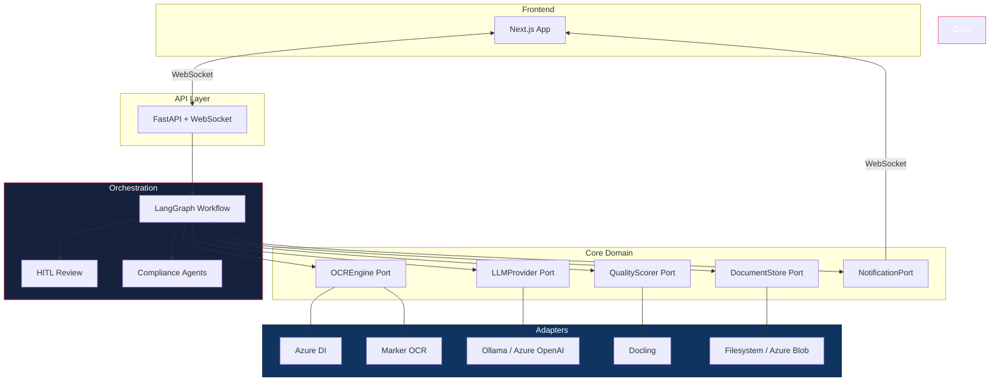
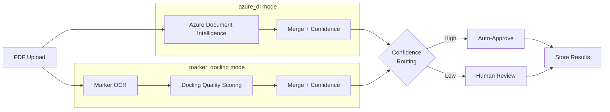

# Auto Transcription

End-to-end document digitalization platform. Converts scanned, printed, and handwritten PDFs into structured digital records with confidence scoring, human-in-the-loop review, and compliance verification.

Built on **Hexagonal Architecture** with pluggable OCR engines, LLM providers, and storage backends — configurable per environment with zero code changes.

---

## Architecture



## Pipeline Modes

Two independent processing flows — switch with one config line:



| | `azure_di` (default) | `marker_docling` |
|---|---|---|
| **Engine** | Azure Document Intelligence | Marker + Docling |
| **Cloud dependency** | Cloud API or disconnected container | None |
| **Local ML models** | None | ~7 GB (Ollama) |
| **Handwriting** | Native per-word detection | Via LLM |
| **Barcodes** | 17+ symbologies | No |
| **Confidence source** | Per-word DI scores | Docling quality scores |

```yaml
# Switch modes — no code changes
pipeline:
  mode: azure_di       # or marker_docling
```

## Quick Start

```bash
# Clone and setup
git clone https://github.com/anmolg1997/Docs-digitization.git
cd Docs-digitization

make setup                            # Create venv, install deps, start infra
cp backend/.env.example backend/.env  # Add your Azure DI credentials
make dev                              # Start backend (8000) + frontend (3000)

# Process a document
make health                           # Verify backend is running
make process-pdf PDF=path/to/doc.pdf  # Upload and process
```

## Key Features

- **Pluggable OCR** — Azure Document Intelligence (cloud + on-prem container) or Marker + Docling (fully offline)
- **Confidence scoring** — Per-page composite scores from OCR confidence + validation rules
- **Human-in-the-loop** — LangGraph `interrupt`/`resume` for low-confidence page review
- **Compliance verification** — ALCOA++, GMP, SOP, and checklist agents via LangGraph subgraph
- **Real-time streaming** — WebSocket updates from LangGraph directly to the browser
- **Split-pane review UI** — Original PDF left, extracted data right, inline editing
- **Config-driven** — Environment-specific YAML + env vars, priority: `env vars > .env > YAML > defaults`
- **On-prem ready** — Azure DI disconnected containers + Ollama for zero cloud dependency

## Tech Stack

| Layer | Technology |
|-------|-----------|
| API | FastAPI, WebSocket, Pydantic |
| Orchestration | LangGraph (StateGraph, interrupt/Command, MemorySaver) |
| OCR | Azure Document Intelligence, Marker, Docling |
| LLM | Ollama (on-prem), Azure OpenAI (cloud) |
| Frontend | Next.js 15, TypeScript, Tailwind CSS, shadcn/ui |
| Database | PostgreSQL (asyncpg) |
| CI/CD | Azure DevOps Pipelines |

## Project Structure

```
├── backend/
│   ├── app/
│   │   ├── core/           # Domain models, ports (Protocol interfaces), services
│   │   ├── adapters/       # OCR, LLM, storage, notification implementations
│   │   ├── config/         # Settings loader, DI container
│   │   ├── workflow/       # LangGraph document + compliance graphs
│   │   ├── compliance/     # ALCOA++, GMP, Checklist, SOP agents
│   │   ├── hitl/           # Review queue, audit trail
│   │   └── api/            # FastAPI routes, WebSocket manager
│   └── config/             # Per-environment YAML configs
├── frontend/               # Next.js app
├── wiki/                   # Detailed technical documentation (25 pages)
└── Makefile                # 35+ targets for dev, test, build, deploy
```

## Configuration Priority

```
1. OS environment variables     ← highest (deployment overrides)
2. .env file                    ← local dev secrets
3. YAML config                  ← environment-specific defaults
4. Pydantic field defaults      ← code fallbacks
```

Enforced by `settings_customise_sources()` — an ops override always wins.

## Documentation

Detailed technical docs live in [`wiki/`](wiki/README.md) — 25 pages covering architecture, OCR engines, workflow, frontend, and DevOps.

**Start here:** [Architecture Overview](wiki/architecture/overview.md) | [Pipeline Modes](wiki/pipeline-modes.md) | [Local Setup](wiki/devops/local-setup.md) | [Quick Commands](wiki/quick_commands.md)

## License

Proprietary. All rights reserved.
