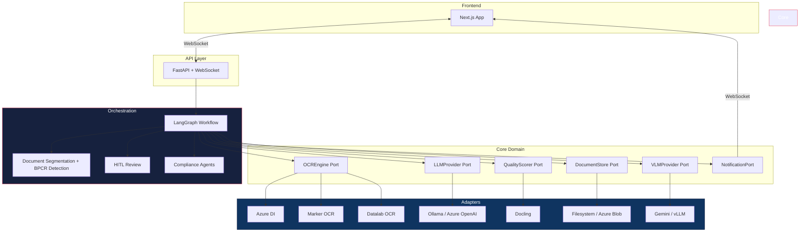
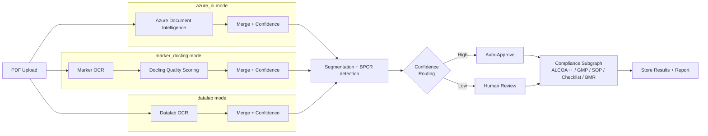

# BMR Compliance Intelligence

Document digitization and pharmaceutical compliance verification platform — converts scanned, printed, and handwritten PDFs (Batch Records, BPCRs, SOPs, checklists) into structured digital records with confidence scoring, document segmentation, BPCR sub-section detection, human-in-the-loop review, and a multi-agent compliance engine.

The product surface is branded **BMR Compliance Intelligence** (engine name on the masthead and report footer); the repo retains its original codename **Auto Transcription / Docs-digitization** for git history continuity.

Built on **Hexagonal Architecture** with pluggable OCR engines, LLM providers, VLM providers, and storage backends — configurable per environment with zero code changes.

---

## Architecture



## Pipeline Modes

Three independent OCR flows — switch with one config line:



| | `azure_di` (default) | `marker_docling` | `datalab` |
|---|---|---|---|
| **Engine** | Azure Document Intelligence | Marker + Docling | Datalab OCR |
| **Cloud dependency** | Cloud API or disconnected container | None | Cloud API |
| **Local ML models** | None | ~7 GB (Ollama) | None |
| **Handwriting** | Native per-word detection | Via LLM | Native |
| **Barcodes** | 17+ symbologies | No | No |
| **Confidence source** | Per-word DI scores | Docling quality scores | Per-block scores |

```yaml
# Switch modes — no code changes
pipeline:
  mode: azure_di       # or marker_docling, or datalab
```

## Quick Start

```bash
# Clone and setup
git clone https://github.com/auropro-hyd/Docs-digitization.git
cd Docs-digitization

make setup                            # Create venv, install deps, start infra
cp backend/.env.example backend/.env  # Add your Azure DI credentials
make dev                              # Start backend (8100) + frontend (3100)

# Process a document
make health                           # Verify backend is running
make process-pdf PDF=path/to/doc.pdf  # Upload and process
```

## Key Features

- **Pluggable OCR** — Azure Document Intelligence (cloud + on-prem container), Marker + Docling (fully offline), or Datalab (cloud)
- **Document segmentation** — single LLM pass that splits a multi-part packet into typed sections (cover, batch_record, SOP, checklist, …), then a deterministic post-pipeline that dedupes, clamps, resolves overlaps, fills gaps, normalises vocab and applies operator HITL overrides
- **BPCR sub-section detection** — heuristic detector (Spec 007) drills into batch-production sections to expose the 13 canonical sub-sections (cover_page, material_dispensing, manufacturing_operations, yield_calculation, …)
- **Confidence scoring** — Per-page composite scores from OCR confidence + validation rules
- **Human-in-the-loop** — LangGraph `interrupt`/`resume` for low-confidence page review, plus a separate HITL surface for segmentation edits that persist across re-runs (`segmentation.overrides.json` sidecar)
- **Compliance engine** — ALCOA++, GMP, SOP, Checklist, and BMR agents via LangGraph subgraph; per-rule applicability, per-page evidence, optional VLM visual checks
- **PDF report renderer** — WeasyPrint-based export (Spec 008) with versioned cache invalidation
- **Real-time streaming** — WebSocket updates from LangGraph directly to the browser
- **Split-pane review UI** — Original PDF left, extracted data right, inline editing, VLM findings badges, visual-evidence viewer with region overlays
- **Config-driven** — Environment-specific YAML + env vars, priority: `env vars > .env > YAML > defaults`
- **On-prem ready** — Azure DI disconnected containers + Ollama for zero cloud dependency

## Tech Stack

| Layer | Technology |
|-------|-----------|
| API | FastAPI, WebSocket, Pydantic |
| Orchestration | LangGraph (StateGraph, interrupt/Command, MemorySaver) |
| OCR | Azure Document Intelligence, Marker, Docling, Datalab |
| LLM | Ollama (on-prem), Azure OpenAI (cloud) |
| VLM | Gemini, vLLM-served vision models |
| Report rendering | WeasyPrint (HTML → PDF) |
| Frontend | Next.js 15.5, React 19, TypeScript 5, Tailwind CSS 4, shadcn/ui |
| State | Zustand 5 |
| Database | PostgreSQL (asyncpg) |
| CI/CD | GitHub Actions (path-filter sentinel, PR-quality gate, weekly maintenance) |

## Project Structure

```
├── backend/
│   ├── app/
│   │   ├── core/           # Domain models, ports (Protocol interfaces), services
│   │   ├── adapters/       # OCR, LLM, VLM, storage, notification, extraction implementations
│   │   ├── config/         # Settings loader, DI container
│   │   ├── workflow/       # LangGraph document + compliance graphs
│   │   ├── compliance/     # Segmentation, BPCR detection, ALCOA++/GMP/SOP/Checklist/BMR agents, report renderer
│   │   ├── bmr/            # BMR-specific capabilities (section detection, rule eval, rerun plan)
│   │   ├── hitl/           # Review queue, audit trail, segmentation overrides
│   │   └── api/            # FastAPI routes, WebSocket manager
│   └── config/             # Per-environment YAML configs
├── frontend/               # Next.js 15 app (App Router)
├── wiki/                   # Detailed technical documentation
├── specs/                  # Spec-Kit specifications (numbered feature specs)
├── .github/                # Workflows, CODEOWNERS, dependabot, issue/PR templates
└── Makefile                # 35+ targets for dev, test, build, deploy
```

## Configuration Priority

```
1. OS environment variables     ← highest (deployment overrides)
2. .env file                    ← local dev secrets
3. YAML config                  ← environment-specific defaults
4. Pydantic field defaults      ← code fallbacks
```

Enforced by `settings_customise_sources()` — an ops override always wins.

## Repository Governance

| File | Purpose |
|------|---------|
| [LICENSE](LICENSE) | Proprietary "All Rights Reserved" — public-read for transparency, no usage rights |
| [SECURITY.md](SECURITY.md) | Vulnerability disclosure policy (GitHub Advisories primary, anmol@auropro.com backup) |
| [CONTRIBUTING.md](CONTRIBUTING.md) | Branch / commit / PR conventions, local-dev setup, Spec-Kit workflow |
| [CODE_OF_CONDUCT.md](CODE_OF_CONDUCT.md) | Contributor Covenant v2.1 |
| [.github/CODEOWNERS](.github/CODEOWNERS) | Path → reviewer routing |
| [.github/dependabot.yml](.github/dependabot.yml) | Weekly pip / npm / github-actions bumps, minor+patch grouped |

## Documentation

Detailed technical docs live in [`wiki/`](wiki/README.md), covering architecture, OCR engines, segmentation, workflow, frontend, compliance governance, and DevOps.

**Start here:** [Architecture Overview](wiki/architecture/overview.md) | [Pipeline Modes](wiki/pipeline-modes.md) | [Document Segmentation](wiki/backend/workflow/segmentation.md) | [GitHub Actions CI](wiki/devops/github-actions-ci.md) | [Local Setup](wiki/devops/local-setup.md) | [Quick Commands](wiki/quick_commands.md)

## License

Proprietary. All rights reserved. See [LICENSE](LICENSE).
