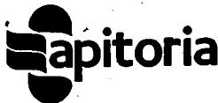
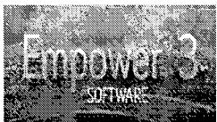
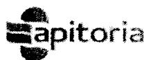

{0}------------------------------------------------

Apitoria logo

APITORIA PHARMA PRIVATE LIMITED

Department: Corporate Quality Assurance

# QC ANALYTICAL DATA REVIEW CHECKLIST

Page  
1 of 2

Product Name and Stage: Serumline HLL 381FP25001326, 381FP25001323  
Batch Number: 2536104192, 2536104193, 2536104194 AR. Number: 381FP25001343  
Instrument Name: HPLL Instrument ID OLW011  
Application Software Name: Empower 3.8.1  
Project/Database: OLT-2015 | HPLC-OLT-2015  
Sample set or Sequence: OLW011-S6.ASSAY-191075-00

| S. No.                                               | Check points                                                                                                                          | Yes / No / NA                                           |
|------------------------------------------------------|---------------------------------------------------------------------------------------------------------------------------------------|---------------------------------------------------------|
| <strong>Part-1 Electronic data verification</strong> |                                                                                                                                       |                                                         |
| 1.                                                   | Are method parameters given as per STP?                                                                                               | Yes                                                     |
| 2.                                                   | Whether system suitability parameters complies as per the STP?                                                                        | Yes                                                     |
| 3.                                                   | Any un-processed data files or Un-reported determinations related to this test found without documenting as per respective SOP?       | No                                                      |
| 4.                                                   | Any unauthorized repetitions of analysis were identified?                                                                             | No                                                      |
| 5.                                                   | Are any re-processed data files found, against to respective SOP?                                                                     | No                                                      |
| 6.                                                   | Any abnormality noticed w.r.t data processing like incorrect processing or manual integration without prior approval?                 | No                                                      |
| 7.                                                   | Hard copy of analytical data is matching with respective electronic data? (Applicable for only where LIMS is not implemented)         | NA                                                      |
| <strong>Part-1 Audit Trail verification</strong>     |                                                                                                                                       |                                                         |
| 8.                                                   | Whether all the QC analyst & reviewer signatures or login credentials (signoff-1) are available at respective sections?               | Yes                                                     |
| 9.                                                   | Any system, Sequence or sample set abortions/ interruptions, or Determination stopped / determinations interrupted errors identified? | No                                                      |
| 10.                                                  | Any Determination started with COND BUSY (Applicable for Tiamo)                                                                       | No                                                      |
| 11.                                                  | Any alteration of sample or batch /sequence /method information was identified against to SOP/STP?                                    | No                                                      |
| 12.                                                  | Any re-processed data files are found against to respective SOP?                                                                      | No                                                      |
| 13.                                                  | Any abnormal messages noticed in Message center logs or system event logs during analysis?                                            | NA                                                      |
| Any other observations -                             |                                                                                                                                       |                                                         |
|                                                      |                                                                                                                                       | Verified by <u>Quesh</u> Sign/Date <u>20/10/2025</u> |

{1}------------------------------------------------

Apitoria logo

APITORIA PHARMA PRIVATE LIMITED

Department: Corporate Quality Assurance

QC ANALYTICAL DATA REVIEW CHECKLIST

Page  
2 of 2

| S. No.                                                                 | Check points                                                                                                                                                                         | Yes / No / NA |
|------------------------------------------------------------------------|--------------------------------------------------------------------------------------------------------------------------------------------------------------------------------------|---------------|
| <strong>Part-2</strong>                                                |                                                                                                                                                                                      |               |
| 14.                                                                    | Is the test performed as per the respective STP?                                                                                                                                     | Yes           |
| 15.                                                                    | Are the instruments/ equipment (HPLC/ GC/ KF/ FT-IR/ Balances/ pH etc...) used for analysis are within the next calibration due?                                                     | Yes           |
| 16.                                                                    | Whether the supporting documents (Chromatograms/ spectrum/ Histograms/ Thermograms/ result reports / balance weight prints, etc...) enclosed with specific batch or LIMS work sheet? | Yes           |
| 17.                                                                    | Whether the usage details are recorded in respective log books (physical or electronic) of instruments, equipments, columns, standards...etc as applicable.                          | Yes           |
| 18.                                                                    | Whether correct calculation was performed by using valid Excel sheet / calculator? (Not applicable where LIMS implemented)                                                           | NA            |
| 19.                                                                    | Hard copy of analytical data is matching with respective electronic data? Or Instrument analytical data is matching with respective LIMS data, where LIMS is implemented?            | Yes           |
| 20.                                                                    | Whether any OOS/ OOT / Deviations / LIR/ LOR) initiated against this batch(s)? (Required for both Initial & Retesting analysis) If yes then Reference No. _________               | NO            |
| 21.                                                                    | If yes to above question, OOS/OOT/Deviation/LIR / LOR closed and report attached?                                                                                                    | NA            |
| <strong>Comments or Any other observations (if any)</strong> - NO - |                                                                                                                                                                                      |               |
| Verified by:  Sign/Date: 21/10/2015           |                                                                                                                                                                                      |               |

Approved By:   
Sign/Date: 21/10/2015

{2}------------------------------------------------

| apitoria          | APITORIA PHARMA PRIVATE LIMITED, UNIT-II                                                                                                     |               | Page 1 of 1 |
|-------------------|----------------------------------------------------------------------------------------------------------------------------------------------|---------------|----------------|
|                   | Department: Quality Control                                                                                                                  |               |                |
|                   | Sample Set Review Check List                                                                                                                 |               |                |
| Product Name      | Sertraline Hcl                                                                                                                               |               |                |
| Test Name         | Assay by HPLC                                                                                                                                |               |                |
| Sample Set Method | QLLV011-S6 Assay - 191025-40                                                                                                                 |               |                |
| S. No             | Checkpoints                                                                                                                                  | YES / NO / NA | Remarks        |
| 1                 | Is Analyst followed sample set method as per SOP?                                                                                            | 44            | -              |
| 2                 | Is Analyst followed vial numbers as per sequence?                                                                                            | 44            | -              |
| 3                 | Is Analyst followed injection volume as per STP?                                                                                             | 44            | -              |
| 4                 | Is Analyst followed No.of injections as STP/SOP?                                                                                             | 44            | -              |
| 5                 | Is Analyst followed Sample name as per sample label?                                                                                         | 44            | -              |
| 6                 | Is Analyst followed Batch number as per sample label?                                                                                        | 44            | -              |
| 7                 | Is Analyst followed A.R. Number as per sample label?                                                                                         | 44            | -              |
| 8                 | Is Analyst followed Method set/ Report method as per STP/SOP?                                                                                | 44            | -              |
| 9                 | Is Analyst followed Run time / Delay time as per STP?                                                                                        | 44            | -              |
| 10                | Is Analyst followed column ID as per SOP?                                                                                                    | 44            | -              |
| 11                | Is Analyst followed Stability Condition / Station as per SOP /STP?                                                                           | NA            | -              |
| 12                | Is Analyst followed Test parameter as per STP / SOP?                                                                                         | 44            | -              |
| 13                | If more than 6 batches, ensure bracketing standard appended after every 6 batches and closing of sequence (for Assay/GC/IC/Content methods)? | 44            | -              |
| 14                | If more than 12 batches, ensure bracketing standard appended after every 12 batches and closing of sequence (for RS/CP/CV)?                  | NA            | -              |
| 15                | Sufficient volume of mobile phase available for analysis in mobile phase bottle?                                                             | 44            | -              |
| 16                | Analyst ensured the pressure gauzes on the gas cylinder before the analysis?                                                                 | NA            | -              |
| 17                | Whether analyst ensured the auto injector syringe holder teeth fit properly before the analysis?                                             | NA            | -              |
| 18                | Is analyst followed vial position in the chromatographic system against the sample set sequence                                              | NA            | -              |
| 19                | Is analyst filled the correct Blank/SST/STD/Sample in Vials corresponding to bench top Glassware (volumetric flasks)                         | 44            | -              |
| 20                | Is analyst ensured "Suction filter connected tube properly connected to respective solvent delivery channels"                                | 44            | -              |
| 21                | Is analyst given Auto sampler purging in injection sequence                                                                                  | NA            | -              |

Prepared by: (Signature) 19/10/2025

Checked by: (Signature) 19/10/2025

{3}------------------------------------------------

Empower 3 logo

# APITORIA PHARMA Pvt.LTD., UNIT-II

## Instrument Method: SG\_ASSAY\_UV2010\_INST

Stored: 18 October 2025 18:29:08 IST

## Method Information

| Method Comments      | New Instrument Method Created                  |
|----------------------|------------------------------------------------|
| Method Modified User | 16837/LabManager                               |
| Method Locked        | No                                             |
| Method Id            | 45848                                          |
| Old Id               |                                                |
| Method Version       | 3                                              |
| Method Edit User     |                                                |
| Source S/W Info      | Empower SPs Installed: 3.8.1 DB ID: 3357404126 |

## LC-2010 Instrument Setup

### \* Report Summary \*

Message No error is occurred.

### \* Pump Generic Info \*

| Mode                      | Isocratic flow            |
|---------------------------|---------------------------|
| LC Stop Time              | 15.00(min)                |
| Pressure Limits (Maximum) | 380(kgf/cm 2 ) |
| Pressure Limits (Minimum) | 0(kgf/cm 2 )   |
| Port                      | A                         |

### \* Pump Prog \*

| Time | Flow | %A    | %B | %C | %D | B.Curve | C.Curve | D.Curve |
|------|------|-------|----|----|----|---------|---------|---------|
| 1    | -    | 1.500 | -  | -  | -  | -       | -       | -       |

### \* UV Detector Info \*

| Lamp            | D2       | Intensity Unit  | Volt      | Sampling Freq.  | 2(Hz)      |
|-----------------|----------|-----------------|-----------|-----------------|------------|
| Polarity        | +        | AUX Range 1     | 1.0(AU/V) | Sampling Period | N/A        |
| Response        | 1.0(sec) | AUX Range 2     | N/A       | Detector Name   | Detector A |
| Cell Temp.      | Low      | Recycle Mode    | N/A       |                 |            |
| Wavelength Ch 1 | 220(nm)  | Threshold Level | N/A       |                 |            |
| Wavelength Ch 2 | N/A      | Use Channel     | Yes       |                 |            |

### \* Autosampler Info \*

| Instrument Status    | On                          | Rinse Dip Time | 0(sec) |
|----------------------|-----------------------------|----------------|--------|
| Sample Rack          | Auto                        | On Time Inj.   | Off    |
| Rinsing Volume       | 200(uL)                     | Cooler Temp.   | Off    |
| Needle Stroke        | 0(mm)                       |                |        |
| Sample Suction Speed | 15.0(uL/sec)                |                |        |
| Rinse Mode           | Before and after aspiration |                |        |

### \* Oven Info \*

| Instrument Status     | On                |
|-----------------------|-------------------|
| Oven Temp.            | 45( $^{\circ}$ C) |
| Temp. Limit (Maximum) | 65( $^{\circ}$ C) |

### \* System Controller Info \*

| Event 1        | Off |
|----------------|-----|
| Event 2        | Off |
| Option Event 1 | N/A |
| Option Event 2 | N/A |

{4}------------------------------------------------

Empower 3 logo

# APITORIA PHARMA Pvt.LTD.,UNIT-II

Option Event 3 N/A  
Degasser On

### \* Channel Info \*

Pump A Pressure Yes  
Oven Temp. No  
Sample Cooler Temp. No  
Room Temp. No  
Detector A Cell Temp. No

### \* Time Prog \*

Time/Action/Value

1 15.00/Stop/-

### \* System Controller Config \*

| System Protection    | Off                 | Opt. Relay 1 | N/A |
|----------------------|---------------------|--------------|-----|
| Sound Alarm On Error | On                  | Opt. Relay 2 | N/A |
| Fire Start Relay On  | All Runs            | Opt. Relay 3 | N/A |
| Pressure Unit        | kgf/cm 2 |              |     |
| Relay 1              | Event               |              |     |
| Relay 2              | Event               |              |     |

### \* Pump Config \*

High Flow-rate Mode Off

### \* UV Detector Config \*

Auto Zero On  
Base Period 100(msec)  
Units V or AU  
Mode Single Mode

### \* Autosampler Config \*

Inj. Trigger Run  
Delay Volume 800( $\mu$ L)

### \* Oven Config \*

Wait Time 0(min)

## Revision History

Version 3 18 October 2025 18:29:08 IST User 16837/LabManager New Instrument Method Created  
Version 2 18 October 2025 18:15:33 IST User 16837/LabManager Saved method 'Untitled' as  
'SG\_ASSAY\_UV2010\_INST'. New Instrument Method Created  
Version 1 30 September 2025 14:31:27 IST User 16837/LabManager Method (WAT19\SEP\_2025\HPG\_SEP\_2025 : 3859) copied into project. (from Full Audit Trail project) Instrument method are copied  
Version 1 31 August 2025 17:55:05 IST User 16837/LabManager Method (WAT19\AUG\_2025\HPG\_AUG\_2025 : 1576) copied into project. (from Full Audit Trail project) Methods copied  
Version 1 31 July 2025 21:10:05 IST User 22715/QCReviewer Method (WAT19\JUL\_2025\HPG\_JUL\_2025 : 3219) copied into project. (from Full Audit Trail project) Copied instrument method from JUL\_2025\HPG\_JUL\_2025 Project from AUG-2025\HPG\_AUG-2025 Project  
Version 1 30 June 2025 20:12:22 IST User 22715/QCReviewer Method (WAT19\JUN\_2025\HPG\_JUN\_2025 : 20052) copied into project. (from Full Audit Trail project) Copied Instrument methods from JUN-2025\HPG\_JUN\_2025 Project to JUL-2025\HPG\_JUL\_2025 Project.  
Version 1 08 June 2025 16:52:28 IST User 16837/LabManager Created method 'SG\_ASSAY\_UV2010\_INST'. New Instrument Method Created