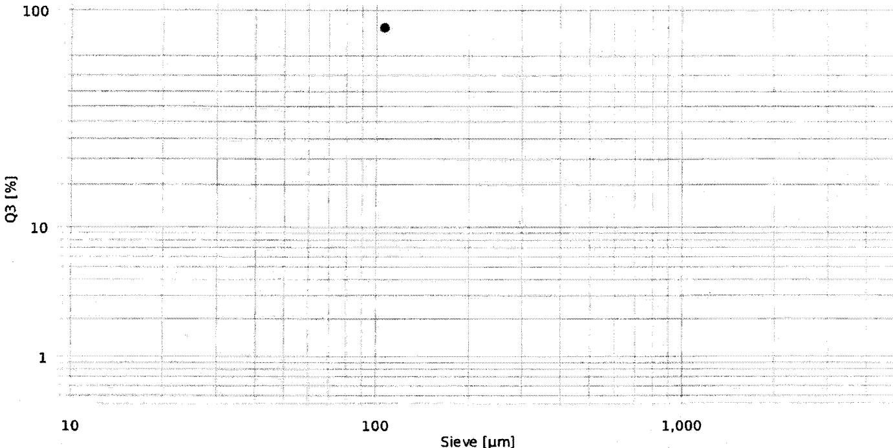

{0}------------------------------------------------

Hosokawa Alpine logo

HOSOKAWA  
ALPINE

# Sieving analysis

e200LS  
HOSOKAWA ALPINE

Sieving method: ALPINE Air Jet Sieve e200 LS

| Name:             | SER_2538104192_106µm_Trail-H | Sieve set:         | 16 / Sertraline HCl(U-8)_10 |
|-------------------|------------------------------|--------------------|-----------------------------|
| Company:          | APITORIA PHARMA PRIVATE LTD  | Sieve set creator: | 16167                       |
| Creator:          | 120683                       | Comment sieve set: | 106µm                       |
| Sieving date:     | 23/10/2025 11:59             | Type:              | Standard                    |
| Material:         | Sertraline HCl               | Operation:         | RFID                        |
| Comment 1:        | 2538104192                   | Method:            | Passage                     |
| Comment 2:        | 25U2C1181                    | Sieving standard:  | ASTM E-11                   |
| Preparation:      | Sample Reducer RPT 1:10      | Framework:         | eLS 203x28mm                |
| Machine:          | P0 234171                    | Firmware e200 LS:  | 0.5.5                       |
| eControl Version: | 1.2.1                        | Firmware PSU:      | 1.2.0                       |

| Result: | d97 = n/a | d50 = n/a | d10 = n/a |
|---------|-----------|-----------|-----------|
|---------|-----------|-----------|-----------|

| Sieve [µm] | Serial No. [No.] | Evaluation |              |             | Weight [g] | Retained [g] | Pressure [Pa] | Sieving time |              | Specification Q3 |            |
|---------------|---------------------|------------|--------------|-------------|---------------|-----------------|------------------|--------------|--------------|------------------|------------|
|               |                     | p3 [%]  | Q3 [%]    | 1-Q3 [%] |               |                 |                  | SET [min] | ACT [min] | Min [%]       | Max [%] |
| 106           | n/a                 | 98.14      | <b>98.14</b> | 1.86        | 5.01          | 0.09            | 2490             | 05:00        | 10:00        | -                | -          |

p3: Fraction Q3: Passage 1-Q3: Retained

Graph showing Q3 [%] (Y-axis, logarithmic scale from 1 to 100) versus Sieve [µm] (X-axis, logarithmic scale from 10 to 1,000). The data point is located at 106 µm, Q3 = 98.14%.

| User       | 120683                                                                              | PW validity | 90 days                                                                                                                                                                                                     |
|------------|-------------------------------------------------------------------------------------|-------------|-------------------------------------------------------------------------------------------------------------------------------------------------------------------------------------------------------------|
| Permission | Level 1                                                                             | Print date  | 23/10/2025 11:59                                                                                                                                                                                            |
| File       | SR_Report_ID_1831.pdf                                                               | Page        | 1/1                                                                                                                                                                                                         |
| Events     |  | Signature   | 
User name: 120683 Full name: Juntupalli Venkata Ramana Timestamp: 2025-10-23 11:59:31 Consent: Yes Liability: Data is correct
  |

{1}------------------------------------------------

2025-10-23

11:18

Sartorius

Mod. SECURA613-10IN

SerNo. 0034105781

BAC: 00-50-02

APC: 01-70-02

G 0.000 g

G + 523.243 g

2025-10-23

11:18

Name:

M. Dacinaid4

MBU

23/10/2025

Tracel -I: 140um Sieve

Sartorius Ltd

B No: 2538104192

Empty 140um Sieve weight

23/10/2025

Printed By: 22786

Printed On: 23-Oct-2025 11:19

{2}------------------------------------------------

---------------------------  
2025-10-23

11:25

Sartorius

Mod. SECURA613-10IN

SerNo. 0034105781

BAC: 00-50-02

APC: 01-70-02  
---------------------------  
  
Trail-I 140um Sieve  
Sertraline HCl  
BN: 2538104192

Comp1 + 5.024 g

Comp2 + 0.011 g  
---------------------------  
  
~~2502 Tufan 23/10/2025~~  
(Sample 140 um sent to Tufan 23/10/2025)  
Sample weight

n

2

x + 2.5175 g

s + 3.5447 g

sRel + 140.80 %

Sum + 5.035 g

Min + 0.011 g

Max + 5.024 g

Diff + 5.013 g  
------------------------------------------------------  
2025-10-23

11:25

Name:

M. da Cunha  
MAV  
---------------------------

23/10/2025

(Signature)  
23/10/2025

Printed By:22786

Printed On:23-Oct-2025 11:26  
  
(Signature)  
23/10/2025

{3}------------------------------------------------

-----------------------  
2025-10-23

11:44

Sartorius

Mod. SECURA613-10IN

SerNo. 0034105781

BAC: 00-50-02

APC: 01-70-02  
-----------------------

G 0.000 g

G + 523.343 g  
-----------------------

2025-10-23

11:44

Name:

M. Dawraidy

-----------------------MBV

23/10/2025

Printed By:22786

Printed On:23-Oct-2025 11:45

Trail-II 140um Sieve

Sertraline HCl

B NO: 2538104192

Ist reading 140um Sieve weight

*GW*  
23/10/2025

APOTEX PHARMA PVT LTD  
23/10/2025

{4}------------------------------------------------

-------------------  
2025-10-23

11:54

Sartorius

Mod. SECURA613-10IN

SerNo. 0034105781

BAC: 00-50-02

APC: 01-70-02  
-------------------

G 0.000 g

G + 523.336 g  
-------------------

*Trial-II 140 um Sieve*  
*Sertraline HCl*  
*BNV: 253B104192*  
*after contents Sieve weight*

2025-10-23

11:54

Name: M. Da'vaidy *MQ*  
-------------------

23/10/2025

*(Signature)*  
23/10/2025

Printed By: 22786

Printed On: 23-Oct-2025 11:55

*(Stamp: APOTEX PHARMA...)*  
*(Signature)*  
23/10/2025