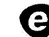
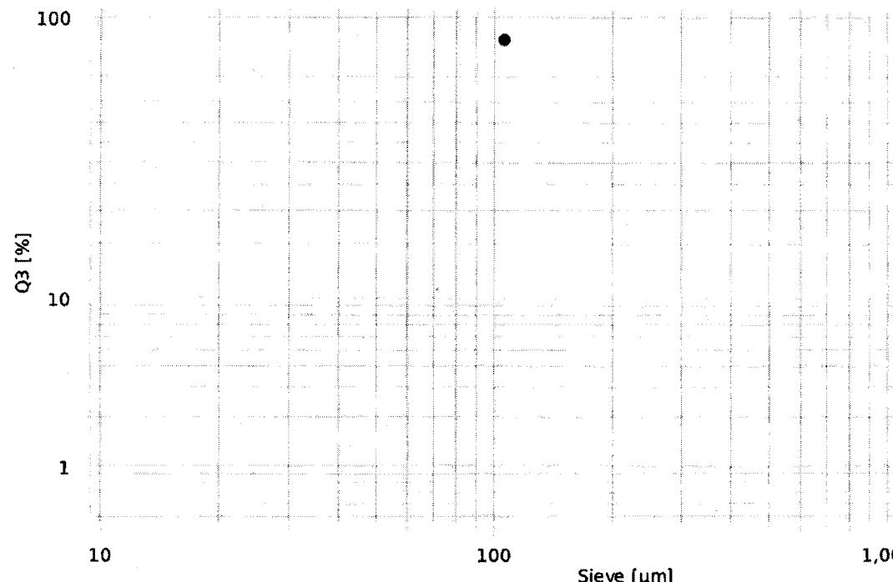
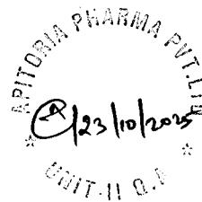

{0}------------------------------------------------

Hosokawa Alpine logo

HOSOKAWA  
ALPINE

# Sieving analysis

Sieving method: ALPINE Air Jet Sieve e200 LS

e200LS logo

e200LS  
HOSOKAWA ALPINE

| Name:             | SER_2538104192_106µm_Trail-II | Sieve set:         | 16 / Sertraline HCl(U-8)_106 |
|-------------------|-------------------------------|--------------------|------------------------------|
| Company:          | APITORIA PHARMA PRIVATE LTD   | Sieve set creator: | 16167                        |
| Creator:          | 120683                        | Comment sieve set: | 106um                        |
| Sieving date:     | 23/10/2025 12:44              | Type:              | Standard                     |
| Material:         | Sertraline HCl                | Operation:         | RFID                         |
| Comment 1:        | 2538104192                    | Method:            | Passage                      |
| Comment 2:        | 25U2C1181                     | Sieving standard:  | ASTM E-11                    |
| Preparation:      | Sample Reducer RPT 1:10       | Framework:         | eLS 203x28mm                 |
| Machine:          | P0 234171                     | Firmware e200 LS:  | 0.5.5                        |
| eControl Version: | 1.2.1                         | Firmware PSU:      | 1.2.0                        |

| Result: | d97 = n/a | d50 = n/a | d10 = n/a |
|---------|-----------|-----------|-----------|
|---------|-----------|-----------|-----------|

| Sieve | Serial No. | Evaluation |        |          | Weight [g] | Retained [g] | Pressure [Pa] | Sieving time |           | Specification Q3 |         |
|-------|------------|------------|--------|----------|------------|--------------|---------------|--------------|-----------|------------------|---------|
|       |            | p3 [%]     | Q3 [%] | 1-Q3 [%] |            |              |               | SET [min]    | ACT [min] | Min [%]          | Max [%] |
| 106   | n/a        | 98.19      | 98.19  | 1.81     | 5.02       | 0.09         | 2490          | 05:00        | 10:00     | -                | -       |

p3: Fraction Q3: Passage 1-Q3: Retained

Graph showing Q3 [%] (Y-axis, logarithmic scale from 1 to 100) versus Sieve [µm] (X-axis, logarithmic scale from 10 to 1,000). The data point is located at approximately 106 µm and 98.19% Q3.

| User       | 120683                | PW validity                          | 90 days          |
|------------|-----------------------|--------------------------------------|------------------|
| Permission | Level 1               | Print date                           | 23/10/2025 12:44 |
| File       | SR_Report_ID_1832.pdf | Page                                 | 1/1              |
| Events     |                       | Signature                            |                  |
|            |                       | User name: 120683                    | 23/10/2025       |
|            |                       | Full name: Juntupalli Venkata Ramana |                  |
|            |                       | Timestamp: 2025-10-23 12:44:52       |                  |
|            |                       | Consent: Yes                         | 23/10/2025       |
|            |                       | Liability: Data is correct           |                  |

{1}------------------------------------------------

---------------------------  
2025-10-23

12:14

Sartorius

Mod. SECURA613-10IN

SerNo. 0034105781

BAC: 00-50-02

APC: 01-70-02  
---------------------------

G 0.000 g

G + 523.244 g  
---------------------------

2025-10-23

12:15

Name:

*M. Daliwaidy*  
---------------------------

*MAW*

*23/10/2025*

Printed By: 22786

Printed On: 23-Oct-2025 12:16

*Trail-II 140 um Sieve :*

*Sertraline Hcl*

*2538104192*

*Empty 140 um Sieve weight*

*[Signature]  
23/10/2025*

*[Stamp: INTAS PHARMA PVT. LTD. UNIT-II Q.A.]  
[Signature]  
23/10/2025*

{2}------------------------------------------------

2025-10-23

12:17

Sartorius

Mod. SECURA613-10IN

SerNo. 0034105781

BAC: 00-50-02

APC: 01-70-02

Comp1 + 5.022 g

Comp2 + 0.004 g

n

2

x + 2.5130 g

s + 3.5483 g

sRel + 141.20 %

Sum + 5.026 g

Min + 0.004 g

Max + 5.022 g

Diff + 5.018 g

2025-10-23

12:18

Name:

M. Dainaidy

MD

23/10/2025

Printed By: 22786

Printed On: 23-Oct-2025 12:18

{3}------------------------------------------------

2025-10-23 1  
2:27

Sartorius

Mod. SECURA613-10IN  
SerNo. 0034105781  
BAC: 00-50-02  
APC: 01-70-02

G 0.000 g

G + 523.344 g

2025-10-23  
12:28

Name:

M. Dawaidy

MBJ

23/10/2025

Trial-II - 140 um Sieve :

Sertraline HCl

B NO: 2538104192

1st 5 mins 140 um Sieve weight

[Signature]  
23/10/2025

Printed By: 22786

Printed On: 23-Oct-2025 12:30

[Signature]  
23/10/2025

{4}------------------------------------------------

-------------------------  
 2025-10-23  
 12:39  
 Sartorius  
 Mod. SECURA613-10IN  
 SerNo. 0034105781  
 BAC: 00-50-02  
 APC: 01-70-02  
 -------------------------

G 0.000  
 g  
 G + 523.335 g  
 -------------------------

2025-10-23  
 12:39  
 Name:  
*M. Dau'naidu*  
*[Signature]*

23/10/2025

Trail-II - 140um Sieve :-

Sertraline HCl

B No: 2538104192

added 10 units 140um Sieve weight

*[Signature]*  
23/10/2025

Printed By: 22786

Printed On: 23-Oct-2025 12:40

APITORIA PHARMA PVT. LTD.  
*[Signature]* 23/10/2025  
 UNIT-II Q.A.