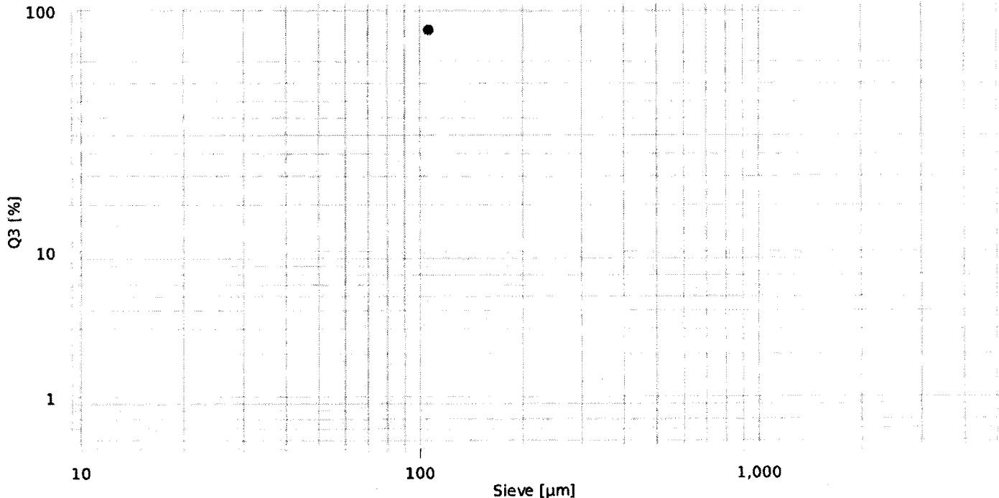

{0}------------------------------------------------

# Sieving analysis Sieving method: ALPINE Air Jet Sieve e200 LS

| Name:             | SER_2538104192_106µm_Trail-III | Sieve set:         | 16 / Sertraline HCl(U-8)_106 |
|-------------------|--------------------------------|--------------------|------------------------------|
| Company:          | APITORIA PHARMA PRIVATE LTD    | Sieve set creator: | 16167                        |
| Creator:          | 120683                         | Comment sieve set: | 106µm                        |
| Sieving date:     | 23/10/2025 13:28               | Type:              | Standard                     |
| Material:         | Sertraline HCl                 | Operation:         | RFID                         |
| Comment 1:        | 2538104192                     | Method:            | Passage                      |
| Comment 2:        | 25U2C1181                      | Sieving standard:  | ASTM E-11                    |
| Preparation:      | Sample Reducer RPT 1:10        | Framework:         | eLS 203x28mm                 |
| Machine:          | PO 234171                      | Firmware e200 LS:  | 0.5.5                        |
| eControl Version: | 1.2.1                          | Firmware PSU:      | 1.2.0                        |

| Result: | d97 = n/a | d50 = n/a | d10 = n/a |
|---------|-----------|-----------|-----------|
|---------|-----------|-----------|-----------|

| Sieve [µm] | Serial No. [No.] | Evaluation |        |          | Weight [g] | Retained [g] | Pressure [Pa] | Sieving time |           | Specification Q3 |         |
|------------|------------------|------------|--------|----------|------------|--------------|---------------|--------------|-----------|------------------|---------|
|            |                  | p3 [%]     | Q3 [%] | 1-Q3 [%] |            |              |               | SET [min]    | ACT [min] | Min [%]          | Max [%] |
| 106        | n/a              | 98.21      | 98.21  | 1.79     | 5.02       | 0.09         | 2490          | 05:00        | 10:00     | -                | -       |

p3: Fraction Q3: Passage 1-Q3: Retained

Graph showing Q3 [%] on the Y-axis (logarithmic scale: 1, 10, 100) versus Sieve [µm] on the X-axis (logarithmic scale: 10, 100, 1,000). The plot displays a single data point representing the measurement:

| Sieve [µm] | Q3 [%] |
|------------|--------|
| 106        | 98.21  |

| User       | 120683                | PW validity                                                                                                                                                                                             | 90 days          |
|------------|-----------------------|---------------------------------------------------------------------------------------------------------------------------------------------------------------------------------------------------------|------------------|
| Permission | Level 1               | Print date                                                                                                                                                                                              | 23/10/2025 13:28 |
| File       | SR_Report_ID_1833.pdf | Page                                                                                                                                                                                                    | 1/1              |
| Events     |                       | <b>Signature</b> User name: 120683 Full name: Juntupalli Venkata Ramana Timestamp: 2025-10-23 13:28:17 Consent: Yes Liability: Data is correct <i>(Handwritten dates: 23/10/2025)</i> |                  |

{1}------------------------------------------------

2025-10-23  
 12:59  
 Sartorius  
 Mod. SECURA613-10IN  
 SerNo. 0034105781  
 BAC: 00-50-02  
 APC: 01-70-02

G 0.000 g

G + 523.244 g

2025-10-23 1  
 2:59  
 Name: M. Devi Naidu

23/10/2025

Trail-III - 140  $\mu$ m Sieve

Sertraline HCl

B NO: 2538104192

140  $\mu$ m Empty Sieve weight

*[Signature]*  
 23/10/2025

Printed By: 22786

Printed On: 23-Oct-2025 13:00

*[Stamp: APITORIA PHARMA PVT. LTD.]*  
*[Signature]*  
 23/10/2025

{2}------------------------------------------------

2025-10-23

13:01

Sartorius

Mod. SECURA613-10IN

SerNo. 0034105781

BAC: 00-50-02

APC: 01-70-02  
Trail-III 140um Sieve  
Sertraline HCl  
B No.: 2538104192  
Sample weight

Comp1 + 5.022 g

Comp2 + 0.004 g

n

2

 $\bar{x}$  + 2.5130 g

s + 3.5483 g

sRel + 141.20 %

Sum + 5.026 g

Min + 0.004 g

Max + 5.022 g

Diff + 5.018 g

2025-10-23

13:02

Name:

M. Padwaidy

MR

23/10/2025

Signature  
23/10/2025

Printed By: 22786

Printed On: 23-Oct-2025 13:02

Stamp: ARTESIA PHARMA PVT. LTD.  
Signature  
23/10/2025

{3}------------------------------------------------

-------------------------  
2025-10-23  
13:12  
Sartorius  
Mod. SECURA613-10IN  
SerNo. 0034105781  
BAC: 00-50-02  
APC: 01-70-02  
-------------------------

G 0.000 g

-------------------------  
G + 523.344 g  
-------------------------

2025-10-23  
13:13  
Name: M. Dakshinaidu  
MD  
-------------------------

23/10/2025

Trial-III - 140 um Sieve :

Sertraline HCl

B NO: 2538104192

Ist 5 mins 140 um Sieve weight

 23/10/2025

Printed By: 22786

Printed On: 23-Oct-2025 13:15

 23/10/2025

{4}------------------------------------------------

------------------  
2025-10-23

13:23

Sartorius

Mod. SECURA613-10IN

SerNo. 0034105781

BAC: 00-50-02

APC: 01-70-02  
------------------

G 0.000 g  
------------------

G + 523.334 g  
------------------

Trail - III - 140um Sieve  
Sertraline HCl  
B No: 2538104192  
after 10 mins 140 um Sieve weight

2025-10-23

13:23

Name: M. padwaidy  
MQ  
------------------

23/10/2025

[Signature]  
23/10/2025

Printed By: 22786

Printed On: 23-Oct-2025 13:24

[Stamp: Signature]  
23/10/2025