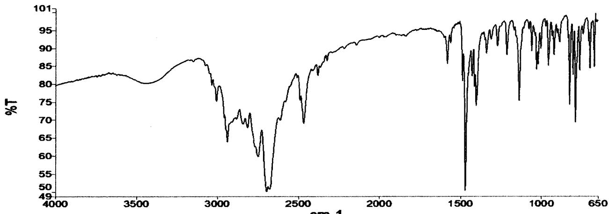
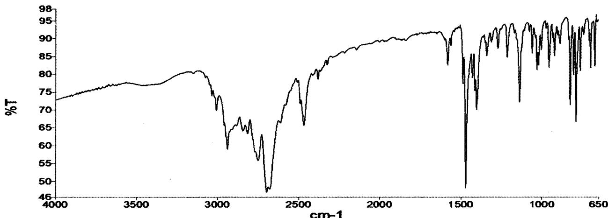
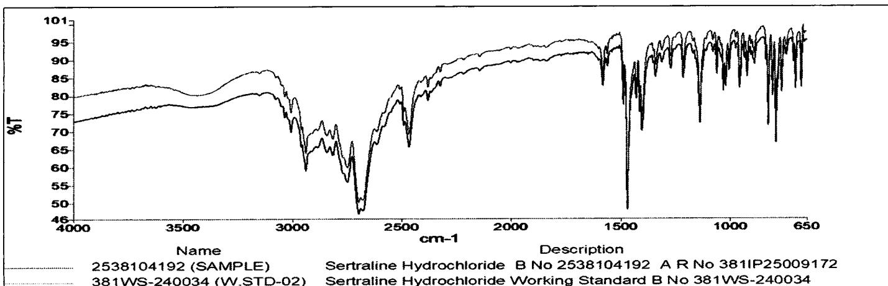

{0}------------------------------------------------

Apitoria logo

APITORIA PHARMA PRIVATE LIMITED, UNIT-II

MANUFACTURING BLOCK - E

IN-PROCESS SAMPLES REQUEST CUM ANALYSIS REPORT

Page  
2 of 2

| Product Name | Sertraline Hydrochloride (Micronized Grade - I) | BPCR Number     | UIIBEHSI103 |
|--------------|-------------------------------------------------|-----------------|-------------|
| Stage        | API                                             | Revision Number | 04          |
| Batch No.    | 2538104192                                      | Batch Size      | 400.0 Kg    |

| REQUEST FROM MANUFACTURING |                                                 |              |                              | REPORT FROM QUALITY CONTROL                                                                                       |                     |          |             |            |                                 |
|----------------------------|-------------------------------------------------|--------------|------------------------------|-------------------------------------------------------------------------------------------------------------------|---------------------|----------|-------------|------------|---------------------------------|
| S. No.                     | Test                                            | Requested by | Time of request (Hrs. - Min) | Specifications                                                                                                    | Result              | A.R. No. | Analyzed by | Checked by | Time of reporting (Hrs. - Min.) |
| 8.                         | Particle size after Micronization Trial run-I   | -            | -                            | Particle size D (v, 0.1), D (v, 0.5) & D (v, 0.9): Report results (or) as per customer Requirement | D (v, 0.1): - $\mu$ | -        | -           | -          | -                               |
|                            |                                                 |              |                              |                                                                                                                   | D (v, 0.5): - $\mu$ |          |             |            |                                 |
|                            |                                                 |              |                              |                                                                                                                   | D (v, 0.9): - $\mu$ |          |             |            |                                 |
| 9.                         | Particle size after Micronization Trial run-II  | -            | -                            |                                                                                                                   | D (v, 0.1): - $\mu$ | -        | -           | -          | -                               |
|                            |                                                 |              |                              |                                                                                                                   | D (v, 0.5): - $\mu$ |          |             |            |                                 |
|                            |                                                 |              |                              |                                                                                                                   | D (v, 0.9): - $\mu$ |          |             |            |                                 |
| 10.                        | Particle size after Micronization Trial run-III | -            | -                            |                                                                                                                   | D (v, 0.1): - $\mu$ | -        | -           | -          | -                               |
|                            |                                                 |              |                              |                                                                                                                   | D (v, 0.5): - $\mu$ |          |             |            |                                 |
|                            |                                                 |              |                              |                                                                                                                   | D (v, 0.9): - $\mu$ |          |             |            |                                 |

{1}------------------------------------------------

IR Spectrum plot showing %T (Y-axis, 49 to 101) versus Wavenumber ( $\text{cm}^{-1}$ , X-axis, 4000 to 650). The spectrum displays characteristic absorption bands for Sertraline Hydrochloride.

Name Description  
381WS-240034 (W.STD-02) Sertraline Hydrochloride Working Standard B No 381WS-240034

## Sample Details 1

| Setting | Filename                                                                                       | Creation Date       |
|---------|------------------------------------------------------------------------------------------------|---------------------|
| Value   | D:\IR DATA\2025\OCT-2025_QIRQ002\Inprocess\Sertraline Hydrochloride\381WS-240034 (W.STD-02).sp | 02/10/2025 21:14:38 |

## Sample Details 1

| Analyst          | Description                                                 |
|------------------|-------------------------------------------------------------|
| Omkar Tandalwade | Sertraline Hydrochloride Working Standard B No 381WS-240034 |

## Workspace Signatures

| Who              | What          | When                | Reason  | Comment                   |
|------------------|---------------|---------------------|---------|---------------------------|
| Omkar Tandalwade | SignWorkspace | 02/10/2025 21:29:40 | Content | Data Submitted For Review |

## Single Peak Table 1

| Peak Number            | 1       | 2       | 3       | 4       | 5       | 6       |
|------------------------|---------|---------|---------|---------|---------|---------|
| X ( $\text{cm}^{-1}$ ) | 3434.41 | 3009.02 | 2939.79 | 2844.30 | 2815.75 | 2749.24 |
| Y (%T)                 | 80.29   | 75.32   | 63.83   | 68.85   | 67.86   | 59.83   |

## Single Peak Table 1

| Peak Number            | 7       | 8       | 9       | 10      | 11      | 12      | 13      |
|------------------------|---------|---------|---------|---------|---------|---------|---------|
| X ( $\text{cm}^{-1}$ ) | 2696.77 | 2468.90 | 2381.74 | 1582.50 | 1561.78 | 1488.78 | 1469.74 |
| Y (%T)                 | 50.00   | 69.14   | 82.51   | 85.85   | 91.60   | 81.03   | 50.40   |

## Single Peak Table 1

| Peak Number            | 14      | 15      | 16      | 17      | 18      | 19      | 20      |
|------------------------|---------|---------|---------|---------|---------|---------|---------|
| X ( $\text{cm}^{-1}$ ) | 1428.92 | 1413.39 | 1403.55 | 1340.18 | 1311.97 | 1270.72 | 1214.02 |
| Y (%T)                 | 82.44   | 79.41   | 74.10   | 88.73   | 92.63   | 90.85   | 88.26   |

## Single Peak Table 1

| Peak Number            | 21      | 22      | 23      | 24      | 25      | 26      | 27     |
|------------------------|---------|---------|---------|---------|---------|---------|--------|
| X ( $\text{cm}^{-1}$ ) | 1136.88 | 1076.97 | 1059.91 | 1029.94 | 1019.85 | 1003.36 | 956.92 |

This Document is Electronically Signed no signature is required

02/10/2025 21:34:42

Page 1 of 2  
02/10/2025

{2}------------------------------------------------

| 21    | 22    | 23    | 24    | 25    | 26    | 27    |
|-------|-------|-------|-------|-------|-------|-------|
| 75.42 | 95.50 | 89.39 | 84.30 | 85.64 | 90.13 | 85.30 |

Single Peak Table 1

| 28     | 29     | 30     | 31     | 32     | 33     | 34     |
|--------|--------|--------|--------|--------|--------|--------|
| 922.31 | 888.27 | 825.23 | 804.68 | 789.36 | 764.07 | 742.67 |
| 88.25  | 91.87  | 74.37  | 82.78  | 69.43  | 83.93  | 94.08  |

Single Peak Table 1

| 35     | 36     | 37     |
|--------|--------|--------|
| 708.65 | 700.23 | 674.31 |
| 92.08  | 84.53  | 84.96  |

{3}------------------------------------------------

Apitoria logo

# Apitoria Pharma Pvt. Ltd. Unit-II Instrument ID:QIRQ002

Make:PerkinElmer  
Model:Frontier  
Software Version:Spectrum ES 10.6.2

IR Spectrum plot showing %T (Y-axis, 46 to 98) versus Wavenumber ( $\text{cm}^{-1}$ , X-axis, 4000 to 650). The spectrum displays characteristic absorption bands for Sertraline Hydrochloride.

| <b>Name</b> 2538104192 (SAMPLE) | <b>Description</b> Sertraline Hydrochloride B No 2538104192 A R No 3811P25009172 |
|------------------------------------|-------------------------------------------------------------------------------------|
|------------------------------------|-------------------------------------------------------------------------------------|

## Sample Details 1

| Setting | Filename                                                                                   | Creation Date       |
|---------|--------------------------------------------------------------------------------------------|---------------------|
| Value   | D:\IR DATA\2025\OCT-2025_QIRQ002\Inprocess\Sertraline Hydrochloride\2538104192 (SAMPLE).sp | 02/10/2025 21:27:02 |

## Sample Details 1

| Analyst          | Description                                                   |
|------------------|---------------------------------------------------------------|
| Omkar Tandalwade | Sertraline Hydrochloride B No 2538104192 A R No 3811P25009172 |

## Workspace Signatures

| Who              | What          | When                | Reason  | Comment                   |
|------------------|---------------|---------------------|---------|---------------------------|
| Omkar Tandalwade | SignWorkspace | 02/10/2025 21:29:40 | Content | Data Submitted For Review |

## Single Peak Table 1

| Peak Number            | 1       | 2       | 3       | 4       | 5       | 6       |
|------------------------|---------|---------|---------|---------|---------|---------|
| X ( $\text{cm}^{-1}$ ) | 3037.83 | 3009.15 | 2939.72 | 2843.95 | 2815.63 | 2749.42 |
| Y (%T)                 | 74.00   | 69.83   | 58.95   | 64.18   | 63.36   | 55.82   |

## Single Peak Table 1

| Peak Number            | 7       | 8       | 9       | 10      | 11      | 12      | 13      |
|------------------------|---------|---------|---------|---------|---------|---------|---------|
| X ( $\text{cm}^{-1}$ ) | 2696.82 | 2468.89 | 2381.92 | 1582.52 | 1561.82 | 1488.82 | 1469.76 |
| Y (%T)                 | 46.85   | 65.66   | 78.71   | 82.74   | 88.27   | 77.46   | 48.04   |

## Single Peak Table 1

| Peak Number            | 14      | 15      | 16      | 17      | 18      | 19      | 20      |
|------------------------|---------|---------|---------|---------|---------|---------|---------|
| X ( $\text{cm}^{-1}$ ) | 1428.90 | 1413.37 | 1403.58 | 1340.27 | 1312.18 | 1270.80 | 1214.05 |
| Y (%T)                 | 79.18   | 75.41   | 70.14   | 85.36   | 89.30   | 87.54   | 84.97   |

## Single Peak Table 1

| Peak Number            | 21      | 22      | 23      | 24      | 25      | 26      | 27     |
|------------------------|---------|---------|---------|---------|---------|---------|--------|
| X ( $\text{cm}^{-1}$ ) | 1136.93 | 1076.97 | 1059.92 | 1030.01 | 1019.79 | 1003.36 | 956.92 |
| Y (%T)                 | 81.44   | 78.34   | 76.45   | 74.21   | 72.10   | 70.55   | 68.90  |

This Document is Electronically Signed no signature is required

02/10/2025 21:35:02

Page 1 of 2

{4}------------------------------------------------

Apitoria logo

# Apitoria Pharma Pvt. Ltd. Unit-II Instrument ID:QIRQ002

Make:PerkinElmer  
Model:Frontier  
Software Version:Spectrum ES 10.6.2

| 21    | 22    | 23    | 24    | 25    | 26    | 27    |
|-------|-------|-------|-------|-------|-------|-------|
| 72.31 | 92.21 | 86.16 | 81.41 | 82.63 | 87.10 | 82.17 |

Single Peak Table 1

| 28     | 29     | 30     | 31     | 32     | 33     | 34     |
|--------|--------|--------|--------|--------|--------|--------|
| 922.32 | 888.23 | 825.25 | 804.67 | 789.32 | 764.10 | 742.58 |
| 85.36  | 88.83  | 71.55  | 79.99  | 66.78  | 81.15  | 91.43  |

Single Peak Table 1

| 35     | 36     | 37     |
|--------|--------|--------|
| 708.64 | 700.26 | 674.36 |
| 89.55  | 81.94  | 82.47  |

IR Spectrum Plot showing %T vs Wavenumber ( $\text{cm}^{-1}$ ) from 4000 to 650. The plot compares the Sample (2538104192) and the Working Standard (381WS-240034). Key peaks are visible around 3300, 2900, 1700, and 1500  $\text{cm}^{-1}$ .

| Name                    | Description                                                   |
|-------------------------|---------------------------------------------------------------|
| 2538104192 (SAMPLE)     | Sertraline Hydrochloride B No 2538104192 A R No 381IP25009172 |
| 381WS-240034 (W.STD-02) | Sertraline Hydrochloride Working Standard B No 381WS-240034   |

Compare Details 1

| Sample Name                                                                                    |
|------------------------------------------------------------------------------------------------|
| D:\IR DATA\2025\OCT-2025_QIRQ002\Inprocess\Sertraline Hydrochloride\381WS-240034 (W.STD-02).sp |

Compare Details 1

| Correlation | Pass / Fail |
|-------------|-------------|
| 0.999405    | Pass        |

This Document is Electronically Signed no signature is required

02/10/2025 21:35:02

02/10/2025  
Page 2 of 2