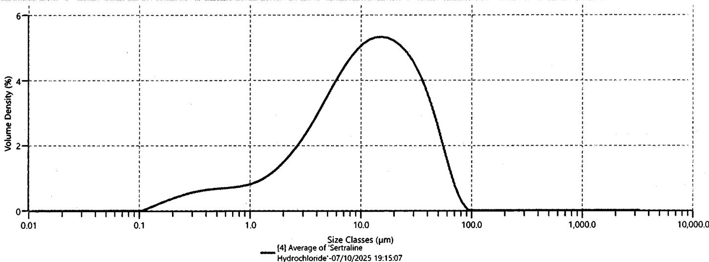

{0}------------------------------------------------

Seventyline H/L

2538104192

PSD-1

07 Oct 2025 19:08

Sensorius

Mod. 2200R02250-10IN

Serial No. 0044203860

0001 00-00-05

0002 01-01-03

0003 01-02-08

0001 0.0007 g

0002 0.0040 g

min: 0.0040 g

max: 0.0007 g

D144: 0.0047 g

07 Oct 2025 19:09

Sensorius

07/10/2017

Seventyline H/L

2538104192

PSD-2

07 Oct 2025 19:16

Sensorius

Mod. 2200R02250-10IN

Serial No. 0044203860

0001 00-00-05

0002 01-01-03

0003 01-02-08

0001 0.0007 g

0002 0.0007 g

min: 0.0007 g

max: 0.0005 g

D144: 0.0006 g

07 Oct 2025 19:17

Sensorius

07/10/2017

Seventyline H/L

2538104192

PSD-3

07 Oct 2025 19:24

Sensorius

Mod. 2200R02250-10IN

Serial No. 0044203860

0001 00-00-05

0002 01-01-03

0003 01-02-08

0001 0.0007 g

0002 0.0032 g

min: 0.0032 g

max: 0.0008 g

D144: 0.0030 g

07 Oct 2025 19:25

Sensorius

07/10/2017

{1}------------------------------------------------

Apitoria logo

APITORIA PHARMA PRIVATE LIMITED, UNIT-II

Department: Quality Control

ADS – Particle Size

Page  
1 of 1

|                                                                                                                                                                                                                                                                                                      | <b>ADS – Particle Size</b> | <b>00007</b>                         |                         |                        |                        |                         |      |    |    |   |
|--------------------------------------------------------------------------------------------------------------------------------------------------------------------------------------------------------------------------------------------------------------------------------------------------------------------------------|----------------------------|--------------------------------------|-------------------------|------------------------|------------------------|-------------------------|------|----|----|---|
|                                                                                                                                                                                                                                                                                                                                |                            |                                      |                         |                        |                        |                         |      |    |    |   |
| <b>Product name</b>                                                                                                                                                                                                                                                                                                            | Sertraline HCl             |                                      |                         |                        |                        |                         |      |    |    |   |
| <b>Batch number</b>                                                                                                                                                                                                                                                                                                            | 2538104192                 |                                      |                         |                        |                        |                         |      |    |    |   |
| <b>A.R. number</b>                                                                                                                                                                                                                                                                                                             | 301IP25009435              | <b>Date:</b> 07/10/2015              |                         |                        |                        |                         |      |    |    |   |
| <b>Specification reference number:</b> SC.106166007-01                                                                                                                                                                                                                                                                         |                            |                                      |                         |                        |                        |                         |      |    |    |   |
| <b>Analytical balance ID</b>                                                                                                                                                                                                                                                                                                   | AB 0020                    |                                      |                         |                        |                        |                         |      |    |    |   |
| <b>Particle size analyzer ID</b>                                                                                                                                                                                                                                                                                               | PS 0002                    |                                      |                         |                        |                        |                         |      |    |    |   |
| <b>Method of measurement</b>                                                                                                                                                                                                                                                                                                   | Dry method                 |                                      |                         |                        |                        |                         |      |    |    |   |
| Weight of sample (g)                                                                                                                                                                                                                                                                                                           | Name of the dispersant     | Volume of the dispersant (mL)        |                         |                        |                        |                         |      |    |    |   |
| ① 1.00347 ② 1.00448 ③ 1.00570                                                                                                                                                                                                                                                                                                  | -                          | -                                    |                         |                        |                        |                         |      |    |    |   |
| <b>Other details:</b> Malvern -3000 accessory Aero S sample distribution Hopper gap as per STP ________ (Yes/ No/ NA)                                                                                                                                                                                                       |                            |                                      |                         |                        |                        |                         |      |    |    |   |
| <b>Result:</b>                                                                                                                                                                                                                                                                                                                 |                            |                                      |                         |                        |                        |                         |      |    |    |   |
| <table border="1"><tr><th>d (0.1), <math>\mu\text{m}</math></th><th>d (0.5), <math>\mu\text{m}</math></th><th>d (0.9), <math>\mu\text{m}</math></th><th>d (0.99), <math>\mu\text{m}</math></th></tr><tr><td align="center">1.51</td><td align="center">11</td><td align="center">38</td><td align="center">-</td></tr></table> |                            |                                      | d (0.1), $\mu\text{m}$  | d (0.5), $\mu\text{m}$ | d (0.9), $\mu\text{m}$ | d (0.99), $\mu\text{m}$ | 1.51 | 11 | 38 | - |
| d (0.1), $\mu\text{m}$                                                                                                                                                                                                                                                                                                         | d (0.5), $\mu\text{m}$     | d (0.9), $\mu\text{m}$               | d (0.99), $\mu\text{m}$ |                        |                        |                         |      |    |    |   |
| 1.51                                                                                                                                                                                                                                                                                                                           | 11                         | 38                                   | -                       |                        |                        |                         |      |    |    |   |
| <b>Remarks: The test <u>Complies</u> / <del>does not comply</del>.</b>                                                                                                                                                                                                                                                         |                            |                                      |                         |                        |                        |                         |      |    |    |   |
| <b>Analyzed by:</b>  07/10/2015                                                                                                                                                                                                                                                                                          |                            | <b>Checked by:</b>  07/10/2015 |                         |                        |                        |                         |      |    |    |   |

{2}------------------------------------------------

# Analysis Report

## APITORIA PHARMA (P) LTD UNIT-II

## Measurement Details

Operator Name 120314  
Sample Name Average of 'Sertraline Hydrochloride'  
SOP File Name Sertraline Hydrochloride\_Dry  
(TOWA).msop  
B.No: 2538104192  
A.R.No: 3811P25009435

## Measurement Details

Analysis Date Time 07/10/2025 19:15:07  
Measurement Date Time 07/10/2025 19:15:07  
Result Source Averaged  
Instrument ID: QPSQ002

## Analysis

Particle Name Sertraline Hydrochloride  
Particle Refractive Index 1.520  
Particle Absorption Index 0.100  
Dispersant Name Dry dispersion  
Dispersant Refractive Index 1.000  
Scattering Model Mie  
Analysis Model General Purpose  
Weighted Residual 0.26 %

### Result

Span 3.292  
Specific Surface Area 1917 m2/kg  
Laser Obscuration 2.82 %  
D [4,3] 15.909 µm  
Dv (10) 1.519 µm  
Dv (50) 11.049 µm  
Dv (90) 37.894 µm  
Dv (95) 47.697 µm

### Trend

|           | Record Number | Sample Name                           | Dx (10) (µm) | Dx (50) (µm) | Dx (90) (µm) |
|-----------|---------------|---------------------------------------|--------------|--------------|--------------|
| Mean      | 4             | Average of 'Sertraline Hydrochloride' | 1.519        | 11.049       | 37.894       |
| 1xStd Dev |               |                                       | 0.000        | 0.000        | 0.000        |
| 1xRSD (%) |               |                                       | 0.000        | 0.000        | 0.000        |

### Frequency (compatible)

Graph showing Volume Density (%) versus Size Classes (µm) on a logarithmic scale. The curve represents the particle size distribution for the sample 'Average of 'Sertraline Hydrochloride'' measured on 07/10/2025 19:15:07. The distribution is unimodal, peaking at approximately 15 µm (Volume Density ~5.0%). Key coordinates include (1.0, 1.0), (15, 5.0), and (100, 0.5).

### Result

| Size (µm) | % Volume Under | Size (µm) | % Volume Under | Size (µm) | % Volume Under | Size (µm) | % Volume Under | Size (µm) | % Volume Under | Size (µm) | % Volume Under | Size (µm) | % Volume Under |
|-----------|----------------|-----------|----------------|-----------|----------------|-----------|----------------|-----------|----------------|-----------|----------------|-----------|----------------|
| 0.010     | 0.00           | 0.077     | 0.00           | 0.594     | 4.93           | 4.583     | 24.80          | 35.335    | 88.24          | 272.430   | 100.00         | 2100.416  | 100.00         |
| 0.011     | 0.00           | 0.088     | 0.00           | 0.675     | 5.51           | 5.207     | 27.71          | 40.146    | 91.45          | 309.525   | 100.00         | 2386.415  | 100.00         |
| 0.013     | 0.00           | 0.100     | 0.00           | 0.767     | 6.11           | 5.916     | 30.90          | 45.613    | 94.22          | 351.670   | 100.00         | 2711.357  | 100.00         |
| 0.015     | 0.00           | 0.113     | 0.00           | 0.872     | 6.73           | 6.722     | 34.37          | 51.823    | 96.46          | 399.555   | 100.00         | 3080.544  | 100.00         |
| 0.017     | 0.00           | 0.128     | 0.07           | 0.991     | 7.38           | 7.637     | 38.09          | 58.880    | 98.12          | 453.960   | 100.00         | 3500.000  | 100.00         |
| 0.019     | 0.00           | 0.146     | 0.20           | 1.125     | 8.07           | 8.677     | 42.04          | 66.897    | 99.21          | 515.772   | 100.00         |           |                |
| 0.022     | 0.00           | 0.166     | 0.40           | 1.279     | 8.83           | 9.858     | 46.17          | 76.006    | 99.79          | 586.001   | 100.00         |           |                |
| 0.024     | 0.00           | 0.188     | 0.66           | 1.453     | 9.67           | 11.201    | 50.46          | 86.355    | 100.00         | 665.793   | 100.00         |           |                |
| 0.028     | 0.00           | 0.214     | 0.98           | 1.651     | 10.62          | 12.726    | 54.84          | 98.114    | 100.00         | 756.449   | 100.00         |           |                |
| 0.032     | 0.00           | 0.243     | 1.36           | 1.875     | 11.70          | 14.458    | 59.28          | 111.473   | 100.00         | 859.450   | 100.00         |           |                |
| 0.036     | 0.00           | 0.276     | 1.78           | 2.131     | 12.93          | 16.427    | 63.73          | 126.652   | 100.00         | 976.475   | 100.00         |           |                |
| 0.041     | 0.00           | 0.314     | 2.24           | 2.421     | 14.33          | 18.664    | 68.15          | 143.897   | 100.00         | 1109.435  | 100.00         |           |                |
| 0.046     | 0.00           | 0.357     | 2.73           | 2.750     | 15.94          | 21.205    | 72.50          | 163.490   | 100.00         | 1260.499  | 100.00         |           |                |
| 0.053     | 0.00           | 0.405     | 3.25           | 3.125     | 17.77          | 24.092    | 76.74          | 185.752   | 100.00         | 1432.133  | 100.00         |           |                |
| 0.060     | 0.00           | 0.460     | 3.80           | 3.550     | 19.85          | 27.373    | 80.82          | 211.044   | 100.00         | 1627.136  | 100.00         |           |                |
| 0.068     | 0.00           | 0.523     | 4.36           | 4.034     | 22.19          | 31.100    | 84.67          | 239.780   | 100.00         | 1848.692  | 100.00         |           |                |

07/10/2025

{3}------------------------------------------------

| Signature | Record Number | Sample Name                           | Signature State | Signatory      | Signature Date             |
|-----------|---------------|---------------------------------------|-----------------|----------------|----------------------------|
|           | 4             | Average of 'Sertraline Hydrochloride' | Signed          | SACSU08\120314 | 07/10/2025 19:33:20 +05:30 |

{4}------------------------------------------------

Apitoria logo

APITORIA PHARMA PRIVATE LIMITED, UNIT-II

Department: Manufacturing

CHECK LIST BEFORE STARTING THE BATCH

Page  
1 of 1

02827

| Block :     | E          | Equipment No. : | SRE024 |
|-------------|------------|-----------------|--------|
| Batch No. : | 2538104192 |                 |        |

| S. No. | Inspection Details                                                                                                                         | YES | NO |
|--------|--------------------------------------------------------------------------------------------------------------------------------------------|-----|----|
| 1.     | Check equipment cleanliness, equipment cleaning and use log record.                                                                        | ✓   | -  |
| 2.     | Check the BPCR contains all pages, In - process request cum report and Request cum Analytical Report                                       | ✓   | -  |
| 3.     | Ensure the clearance from QA in case of product change over.                                                                               | -   | ✓  |
| 4.     | Cross check the raw material quantities are as per the requisition.                                                                        | ✓   | -  |
| 5.     | Check all raw materials / intermediates dispensing tags contains required information and signature.                                       | ✓   | -  |
| 6.     | In case of recovered / purified solvents are going to use in the batch ensure the quantities and approval from quality control department. | ✓   | -  |
| 7.     | Ensure the necessary safety appliances are available.                                                                                      | ✓   | -  |
| 8.     | Check the scrubber condition and tank with neutralizing material.                                                                          | ✓   | -  |
| 9.     | Check calibration due date of the measuring instruments like compound / vacuum / pressure gauges & digital thermometers.                   | ✓   | -  |
| 10.    | Check the required utility services are available to the reactor and heat exchangers                                                       | ✓   | -  |
| 11.    | Check the Equipment Status Board.                                                                                                          | ✓   | -  |
| 12.    | Before batch charging, ensure the batch status change in ERP from pending to work in process (WIP).                                        | ✓   | -  |

## *In case of reprocessing of batch ensure the below points*

| 13. | Relevant/Suitable Reprocess BPCR is available with respect to intended test parameter.                                    | - | ✓ |
|-----|---------------------------------------------------------------------------------------------------------------------------|---|---|
| 14. | Relevant Reprocess CRF (Change Request from) with respect to intended test parameter is approved.                         | - | ✓ |
| 15. | Ensure the process capability for intended test parameter is meeting the specification with experiments/ data evaluation. | - | ✓ |

| Checked By Sign. & Date (Executive - Manufacturing) |  29/09/2025 |
|--------------------------------------------------------|--------------------------------------|
|--------------------------------------------------------|--------------------------------------|