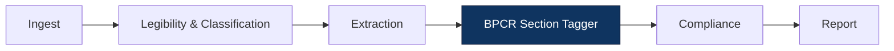
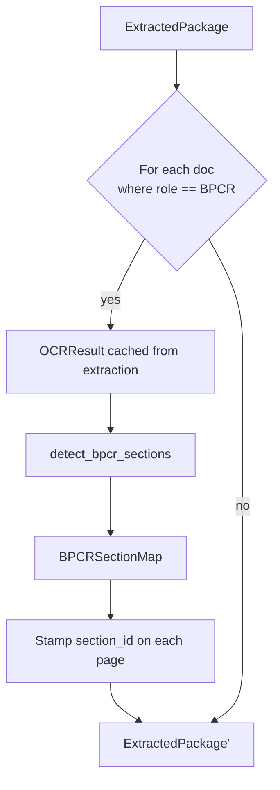

# Data Model: BPCR Layout-Aware Section Detection

All new types are Pydantic models; existing types are extended additively (no required-field additions).

---

## New Types

### `SectionSpan`

```python
class SectionSpan(BaseModel):
    section_id: str            # slug from canonical list, OR "unsectioned"
    display_name: str          # human-readable; empty for "unsectioned"
    start_page: int            # inclusive, 1-indexed within the document
    end_page: int              # inclusive, 1-indexed within the document
    confidence: float = Field(ge=0.0, le=1.0)
    detection_method: str      # see DetectionMethod below
    matched_text: str = ""     # the actual OCR span that matched the regex (for evidence)
    matched_band: str = ""     # "top_of_page" | "top_of_table" | "mid_page"

    model_config = ConfigDict(frozen=True)
```

`section_id` follows the slug pattern `^[a-z][a-z0-9_]*$`. The literal `unsectioned` is reserved and is the only `section_id` whose `display_name` may be empty.

### `BPCRSectionMap`

```python
class BPCRSectionMap(BaseModel):
    doc_id: str                # the BPCR document this map belongs to
    spec_version: str          # version of the canonical sections spec used
    spans: list[SectionSpan]   # ordered by start_page; covers every page in the doc
    detector_version: str      # capability version (semver) — bump when heuristic changes
    method: str                # "heuristic" | "vlm" | "hybrid"
    outcome: str               # "ok" | "partial" | "failed"
    notes: list[str] = Field(default_factory=list)

    model_config = ConfigDict(frozen=True)

    def section_for_page(self, page_index: int) -> str | None:
        """Return the section_id for a given 1-indexed page, or None if unmapped."""
```

**Invariants:**

1. `spans` MUST cover every page in the document with no gaps and no overlaps.
2. The `spans` list MUST be sorted by `start_page` ascending.
3. If `outcome == "failed"`, `spans` MUST contain exactly one span: `(section_id="unsectioned", start_page=1, end_page=N)`.
4. `spec_version` MUST equal the `spec_version` field of the `BPCRSectionsSpec` used to construct this map.
5. `detector_version` MUST equal the capability's module-level `DETECTOR_VERSION` constant at construction time.

### `BPCRSectionsSpec` (the canonical list, loaded from YAML)

```python
class BPCRSectionEntry(BaseModel):
    section_id: str            # slug; cannot be "unsectioned"
    display_name: str
    aliases: list[str] = Field(default_factory=list)
    regex: list[str] = Field(default_factory=list)         # additional regex patterns
    bands: list[str] = Field(default_factory=lambda: ["top_of_page"])
    requires_emphasis_for_mid_page: bool = True

class BPCRSectionsSpec(BaseModel):
    spec_version: str          # semver
    sections: list[BPCRSectionEntry]

    model_config = ConfigDict(frozen=True)
```

YAML shape:

```yaml
spec_version: "1.0"
sections:
  - section_id: yield_calculation
    display_name: "Yield Calculation"
    aliases:
      - "Yield Reconciliation"
    regex:
      - "^\\s*Yield\\s+Calculation\\b"
    bands:
      - top_of_page
      - top_of_table
      - mid_page
    requires_emphasis_for_mid_page: true
```

### `DetectionMethod` (string enum-shape, kept as strings to stay JSON-portable)

| Value | Meaning |
|---|---|
| `heuristic_top_of_page` | Heuristic matched a header in the top 20% of the page. |
| `heuristic_top_of_table` | Heuristic matched a header on the first row of a table. |
| `heuristic_mid_page` | Heuristic matched a header in the 20%–80% band with emphasis. |
| `vlm_top_band` | VLM classified the page using its top-band crop. |
| `vlm_mid_band` | VLM classified the page using its mid-band crop. |
| `unmatched` | No detection method produced a confident hit; page is `unsectioned`. |

---

## Modified Types

### `ExtractedPage` (additive)

```diff
 class ExtractedPage(BaseModel):
     doc_id: str
     document_role: str
     page_index: int = Field(ge=1)
     tags: list[str] = Field(default_factory=list)
     fields: list[FieldValue] = Field(default_factory=list)
+    # Spec 007 — populated by the BPCR section-tagger only when the
+    # document_role is BPCR and section detection ran successfully.
+    # None means: either non-BPCR, or section detection disabled, or
+    # the detector failed for this document.
+    section_id: str | None = None

     model_config = ConfigDict(frozen=True)
```

### `EvidenceRegion` (additive)

```diff
 class EvidenceRegion(BaseModel):
     doc_id: str
     page_index: int
     bbox: tuple[float, float, float, float] | None = None
     ...
+    # Spec 007 — copied through from the matched ExtractedPage when set.
+    section_id: str | None = None
```

Capability evaluators (`same_page_eval_v1`, `cross_doc_rule_eval_v1`, `page_aggregate_eval_v1`) populate `section_id` on emitted evidence whenever the matched page carries one.

### `page_selector` (rule schema 1.1, additive)

```diff
 page_selector:
   document_role: BPCR
   page_filter: all_bpcr_step_pages
+  section_id: yield_calculation        # OPTIONAL — when set, restrict to pages in this section
```

JSON Schema fragment (1.1 only):

```json
"section_id": {
  "type": "string",
  "pattern": "^[a-z][a-z0-9_]*$",
  "description": "Restrict the selector to pages whose detected section_id matches. See spec 007."
}
```

The pattern deliberately excludes the literal `unsectioned` from authorship: a rule cannot target the sentinel.

### `RuleBank.LoadedRule` (no change to surface; one new derived property)

```diff
 class LoadedRule:
     ...
+    @property
+    def section_id_filter(self) -> str | None:
+        return (self.rule.get("context_object", {})
+                          .get("page_selector", {})
+                          .get("section_id"))
```

---

## Persistence

- `BPCRSectionMap` is held on the in-memory `BMRRunState` for the duration of the run, keyed by BPCR `doc_id`. It is **not** persisted standalone.
- `section_id` on `ExtractedPage` and `EvidenceRegion` *is* persisted because both already round-trip into the run report and the audit trail. JSON output omits the field when `None`.
- The canonical section spec's `spec_version` is recorded inside `BPCRSectionMap`, which is in turn cited by every `EvidenceRegion` produced from sectioned pages — so a finding always carries the spec version that produced its section assignment (audit trail).

---

## Migration

- v1.0 rules: zero migration. They never look at `section_id`; the selector helper short-circuits when the rule's `section_id_filter` is `None`.
- v1.0 fixtures: zero migration. `ExtractedPage.section_id` defaults to `None`; existing tests don't observe it.
- Persisted reports written before this change: deserialise with `section_id=None`. Any reports replayed will simply not show section grouping.

---

## Diagrams

### Pipeline placement



### Inside the tagger


