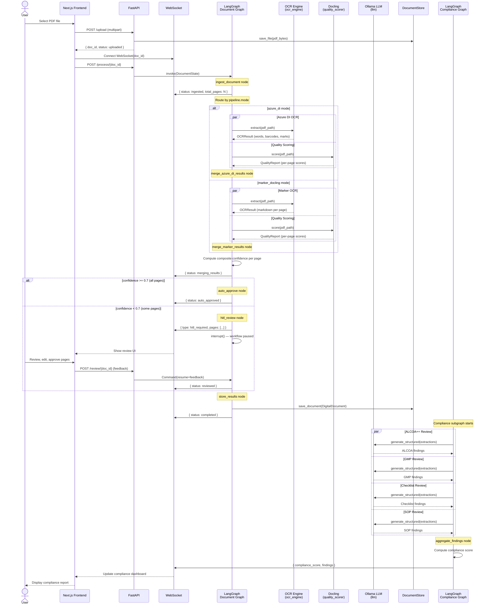

# Data Flow: PDF Upload to Compliance Report

This document traces the complete lifecycle of a document through the system, from user upload to the final compliance dashboard.

## Pipeline Summary

```
Upload → Ingest → Route by Pipeline Mode
    → [azure_di mode] → Run Azure DI + Quality → merge_azure_di_results → Confidence Routing
    → [marker_docling mode] → Run Marker + Quality → merge_marker_results → Confidence Routing
    → [HITL Review if needed] → Store → Compliance Subgraph → Dashboard
```

The pipeline is implemented as two LangGraph `StateGraph` instances:
1. **Document Graph** (`app/workflow/document_graph.py`) -- ingestion through storage
2. **Compliance Graph** (`app/workflow/compliance_graph.py`) -- ALCOA++, GMP, Checklist, SOP analysis

---

## Step-by-Step Flow

### Step 1: User Uploads PDF

The user selects a PDF via the Next.js frontend (`frontend/src/components/upload/document-upload.tsx`). The file is sent as a multipart upload to the FastAPI backend.

### Step 2: FastAPI Receives and Saves

The `/upload` endpoint (`app/api/routes/documents.py`):

1. Generates a `doc_id` (UUID4)
2. Creates the document directory at `{storage.base_path}/{doc_id}/`
3. Writes the raw PDF to disk
4. Returns `{ doc_id, filename, size_bytes, status: "uploaded" }`

The frontend establishes a WebSocket connection on `doc_id` to receive real-time progress updates.

### Step 3: LangGraph Workflow Starts

The Document Graph is invoked with initial `DocumentState`:

```python
{
    "doc_id": "abc-123-...",
    "pdf_path": "/data/documents/abc-123-.../document.pdf",
    "filename": "batch-record.pdf",
    "total_pages": 0,         # set during ingest
    "marker_results": {},
    "azure_di_results": {},
    "quality_scores": {},
    "extractions": [],
    "confidence_scores": {},
    "status": "uploaded",
}
```

### Step 4: Ingest Node

The `ingest_document` node validates the PDF and determines the page count:

1. Checks that the PDF file exists at `pdf_path`
2. Opens with PyMuPDF (`fitz`) to count pages
3. Sends a WebSocket notification: `{ type: "status", status: "ingested", total_pages: N }`
4. Returns `{ total_pages: N, status: "ingested" }`

If the PDF is missing or corrupt, the workflow routes to `handle_error`.

### Step 5: Pipeline Mode Routing

The `route_after_ingest` conditional edge reads `settings.pipeline.mode` and routes to the appropriate branch:

- **`"azure_di"` mode** — runs Azure DI OCR + Docling quality scoring in parallel
- **`"marker_docling"` mode** — runs Marker OCR + Docling quality scoring in parallel

Each mode issues two `Send` objects:

```python
# azure_di mode
[
    Send("run_azure_di_ocr", state),
    Send("run_quality_scoring", state),
]

# marker_docling mode
[
    Send("run_marker_ocr", state),
    Send("run_quality_scoring", state),
]
```

Both branches run their OCR and quality scoring concurrently, sending WebSocket status updates as they progress.

#### 5a: Marker OCR (marker_docling mode)

- Calls `container.ocr_engine.extract(pdf_path)` via the `OCREngine` port
- Marker's `PdfConverter` processes the full PDF (runs in executor for async compat)
- Splits paginated markdown output on `\n\n---\n\n`
- Returns per-page markdown and word counts in `marker_results`

#### 5b: Azure DI OCR (azure_di mode)

- Calls `container.ocr_engine.extract(pdf_path)` via the `OCREngine` port
- Sends the PDF to Azure Document Intelligence `prebuilt-layout` model
- Extracts per-word confidence scores, handwriting flags, barcodes, and selection marks
- Returns structured per-page data in `azure_di_results`

#### 5c: Docling Quality Scoring (both modes)

- Calls `container.quality_scorer.score(pdf_path)` via the `QualityScorer` port
- Docling's `DocumentConverter` produces per-page scores for layout, table, OCR, and parse quality
- Returns a `QualityReport` serialized into `quality_scores`

### Step 6: Merge Node (mode-specific)

Each pipeline mode has its own merge node:

#### `merge_azure_di_results` (azure_di mode)

Converges Azure DI OCR and Docling quality branches. For each page:

1. Uses Azure DI's structured output (markdown, handwriting counts, barcodes, selection marks)
2. Computes a **composite confidence score** using Azure DI word-level confidence and Docling quality:

| Factor | Weight | Source |
|--------|--------|--------|
| Azure DI min word confidence | 0.35 | Lowest per-word confidence on the page |
| Docling mean quality | 0.35 | Average of layout, table, OCR, parse scores |
| Validation rules | 0.30 | Custom validation pass rate (`rules_passed / rules_checked`) |

3. Produces unified `extractions` list and `confidence_scores` dict

#### `merge_marker_results` (marker_docling mode)

Converges Marker OCR and Docling quality branches. For each page:

1. Uses Marker's markdown output combined with Docling quality scores
2. Computes a **composite confidence score** using Docling quality scores:

| Factor | Weight | Source |
|--------|--------|--------|
| Docling mean quality | 0.40 | Average of layout, table, OCR, parse scores |
| Marker table quality | 0.30 | Table detection score (1-5 scale, normalized) |
| Validation rules | 0.30 | Custom validation pass rate (`rules_passed / rules_checked`) |

3. Produces unified `extractions` list and `confidence_scores` dict

### Step 7: Confidence Routing

The `route_by_confidence` conditional edge examines the minimum confidence score across all pages:

| Confidence Range | Route | Behavior |
|-----------------|-------|----------|
| >= 0.9 | `auto_approve` | All pages approved automatically |
| 0.7 - 0.9 | `auto_approve` | Approved (batch review available if enabled) |
| < 0.7 | `hitl_review` | Human review required |

Thresholds are configured in `settings.hitl`:

```yaml
hitl:
  auto_approve_threshold: 0.9
  review_threshold: 0.7
  batch_review_enabled: true
```

### Step 8: HITL Review (if needed)

When pages fall below the review threshold:

1. The `hitl_review` node collects all pages needing review, sorted by confidence (lowest first)
2. Sends a WebSocket notification: `{ type: "hitl_required", pages_count: N, pages: [...] }`
3. Calls `interrupt()` with the review payload -- this **pauses the workflow**
4. The frontend renders the review UI (`frontend/src/components/review/review-interface.tsx`)

### Step 9: Human Reviews and Resumes

The reviewer sees:
- Original PDF page
- Extracted markdown
- Confidence scores and quality grades
- Handwritten content flags
- Barcode and selection mark data

The reviewer can edit text, approve, or reject. On submission, the frontend sends:

```python
Command(resume={
    "approved_pages": [...],
    "edited_pages": {...},
    "rejected_pages": [...]
})
```

The workflow resumes from the interrupt point with the feedback in `hitl_decisions`.

### Step 10: Store Results

The `store_results` node:

1. Constructs a `DigitalDocument` from the workflow state (metadata, raw markdown, sections)
2. Calls `container.document_store.save_document(doc)` via the `DocumentStore` port
3. Sends a WebSocket notification: `{ type: "status", status: "completed" }`

### Step 11: Compliance Subgraph

The Compliance Graph is invoked with the document's extractions and sections. It fans out to four parallel agents via `Send`:

```python
[
    Send("alcoa_review", state),       # ALCOA++ compliance
    Send("gmp_review", state),         # GMP compliance
    Send("checklist_review", state),   # Checklist-based review
    Send("sop_review", state),         # BMR review against SOP
]
```

Each agent:
1. Receives the document extractions
2. Uses the `LLMProvider` port (via `container.llm`) to analyze content against its ruleset
3. Returns a list of findings with `rule_id`, `severity`, `page_num`, `description`, and `recommendation`

### Step 12: Aggregate Findings

The `aggregate_findings` node:

1. Combines all findings from the four agents
2. Computes a compliance score (starts at 100, deducts by severity):

| Severity | Deduction |
|----------|-----------|
| Critical | -10 |
| Major | -5 |
| Minor | -2 |
| Observation | -1 |

3. Returns `aggregated_findings` and `compliance_score`

### Step 13: Frontend Dashboard

The compliance dashboard (`frontend/src/components/compliance/compliance-dashboard.tsx`) displays:
- Overall compliance score
- Findings grouped by agent (ALCOA++, GMP, Checklist, SOP)
- Per-page findings with severity indicators
- Recommendations for remediation

---

## Sequence Diagram



---

## State Transitions

The `DocumentState.status` field tracks progress:

```
uploaded → ingested → [route by pipeline.mode]
    azure_di mode:       → azure_di_running   → azure_di_complete
                         → quality_scoring    → quality_scored
                         → merging_results (merge_azure_di_results) → merged
    marker_docling mode: → marker_ocr_running → marker_complete
                         → quality_scoring    → quality_scored
                         → merging_results (merge_marker_results) → merged
         → auto_approved / reviewed
         → completed
```

Error states: `marker_error`, `azure_di_error`, `quality_error`, `error`

---

## Key Design Decisions

1. **Pipeline mode routing, not parallel dual-OCR** -- The `pipeline.mode` setting selects a single OCR engine (`"azure_di"` or `"marker_docling"`). Each mode has its own merge node (`merge_azure_di_results` or `merge_marker_results`) and confidence formula tuned to the engine's output characteristics.

2. **Quality scoring is independent** -- Docling runs alongside the selected OCR engine, not after it. Its scores are used for confidence calculation, not for content extraction.

3. **Mode-specific composite confidence** -- Each merge node uses a confidence formula tailored to its OCR engine. Azure DI mode leverages word-level confidence; Marker mode relies on Docling quality scores and table detection.

4. **`interrupt()` for HITL** -- LangGraph's native interrupt/resume mechanism persists workflow state to the checkpointer. The workflow can be paused for hours or days without losing progress.

5. **Compliance agents are embarrassingly parallel** -- ALCOA++, GMP, Checklist, and SOP reviews are independent. Fan-out via `Send` runs all four concurrently against the LLM.

---

## Related Pages

- [Architecture Overview](overview.md) -- System architecture and layer diagram
- [Ports & Adapters](ports-and-adapters.md) -- Port contracts invoked at each step
- [Deployment Environments](deployment-environments.md) -- How adapters differ per environment
- [Back to Wiki Home](../README.md)
