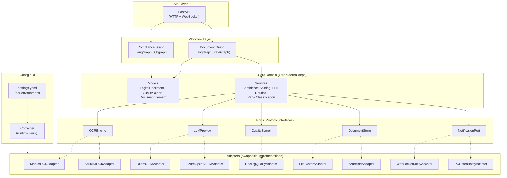

# Architecture Overview

## Why Hexagonal Architecture?

This platform is a **document processing pipeline with pluggable components**, not a CRUD application with isolated features. The key architectural requirement is the ability to swap entire subsystems (OCR engines, LLM providers, storage backends) without touching business logic.

### Hexagonal vs. Vertical Slice Architecture (VSA)

| Concern | VSA | Hexagonal |
|---------|-----|-----------|
| **Organizing principle** | Features/use-cases | Dependencies & contracts |
| **Best for** | CRUD apps with independent feature slices | Pipelines with shared core and pluggable I/O |
| **Cross-cutting concerns** | Duplicated or extracted into shared folders | Naturally isolated behind ports |
| **Swapping an OCR engine** | Touch every slice that uses OCR | Change one adapter, wire it in the container |
| **Testing** | Feature-level integration tests | Port-level unit tests with mock adapters |

VSA organizes code around *features* (e.g., "Upload Document", "Review Page"). This works well when features are independent CRUD operations. But in a processing pipeline, the same OCR engine, LLM provider, and storage backend are shared across every step. VSA would force either:

1. **Duplication** -- each slice reimplements adapter wiring
2. **Shared infrastructure** -- which defeats the purpose of isolated slices

Hexagonal Architecture isolates the **core domain** (models, business rules, confidence scoring) from **external systems** (OCR, LLM, storage) through explicit Protocol interfaces. The core never imports from `marker`, `azure`, `ollama`, or `docling` -- it only knows about the port contracts.

## The Three Layers

### 1. Core Domain (`app/core/`)

Zero external dependencies. Contains:

- **Models** (`app/core/models/`) -- `DigitalDocument`, `DocumentSection`, `DocumentElement`, `QualityReport`, `PageQualityScore`, and all element types (tables, signatures, checkboxes, key-value pairs)
- **Ports** (`app/core/ports/`) -- Protocol interfaces for `OCREngine`, `LLMProvider`, `QualityScorer`, `DocumentStore`, `NotificationPort`
- **Services** (`app/core/services/`) -- Pure business logic: composite confidence scoring, HITL routing, page classification, section building, validation rules

The core depends on nothing outside `pydantic` and the Python standard library. It defines *what* the system does, not *how*.

### 2. Ports (`app/core/ports/`)

Python `Protocol` interfaces that define the contract between the core domain and the outside world. Each port specifies:

- Method signatures (async where I/O is involved)
- Input/output types (using core domain models, not vendor types)
- Behavioral expectations (documented in docstrings)

There are five ports:

| Port | Purpose |
|------|---------|
| `OCREngine` | Extract text, handwriting, barcodes from PDFs |
| `LLMProvider` | Text generation and structured output |
| `QualityScorer` | Per-page quality assessment |
| `DocumentStore` | Document and file persistence |
| `NotificationPort` | Real-time event delivery to frontend |

See [Ports & Adapters](ports-and-adapters.md) for the full Protocol definitions and all adapter implementations.

### 3. Adapters (`app/adapters/`)

Concrete implementations of the port Protocols. Each adapter:

- Lives in its own module under `app/adapters/<category>/`
- Imports only from its vendor SDK and the port's types
- Uses lazy initialization for heavy resources (model loading, client creation)
- Is registered in the DI container (`app/config/container.py`)

Current adapter matrix:

| Port | Adapter | When Used |
|------|---------|-----------|
| `OCREngine` | `MarkerOCRAdapter` | Primary OCR (all environments) |
| `OCREngine` | `AzureDIOCRAdapter` | Secondary OCR (handwriting, barcodes) |
| `LLMProvider` | `OllamaLLMAdapter` | Production (on-prem) |
| `LLMProvider` | `AzureOpenAILLMAdapter` | Dev/staging fallback |
| `QualityScorer` | `DoclingQualityAdapter` | All environments |
| `DocumentStore` | `FileSystemAdapter` | Dev and on-prem production |
| `DocumentStore` | `AzureBlobAdapter` | Azure staging |
| `NotificationPort` | `WebSocketNotifyAdapter` | Single-worker (primary) |
| `NotificationPort` | `PGListenNotifyAdapter` | Multi-worker deployments |

## Config + DI Wiring

The **settings loader** (`app/config/settings.py`) reads per-environment YAML files (`settings.dev.yaml`, `settings.staging.yaml`, `settings.prod.yaml`), overlaid with environment variables prefixed `AT_`.

The **DI container** (`app/config/container.py`) resolves adapters at runtime based on config values:

```python
# Pseudocode of the resolution flow
settings.ocr.primary_engine = "marker"  # from YAML
container.primary_ocr  →  MarkerOCRAdapter(settings.marker)

settings.llm.provider = "ollama"        # from YAML
container.llm  →  OllamaLLMAdapter(settings.llm)
```

Swapping an engine is a one-line config change -- no code modifications needed.

## LangGraph Workflow Layer

The LangGraph `StateGraph` sits on top of the architecture. Workflow nodes call ports through the DI container, never concrete adapters:

```python
# From app/workflow/nodes.py
container = get_container()
result = await container.primary_ocr.extract(state["pdf_path"])   # port, not adapter
report = await container.quality_scorer.score(state["pdf_path"])  # port, not adapter
```

This means the workflow is entirely adapter-agnostic. The same graph runs against Marker+Ollama locally and Azure DI+Azure OpenAI in staging.

## FastAPI as a Thin API Layer

FastAPI handles HTTP/WebSocket concerns only:

- Receives file uploads, assigns `doc_id`, saves to storage
- Triggers the LangGraph workflow
- Serves WebSocket connections for real-time progress updates
- Exposes review and compliance endpoints

It does not contain business logic -- all processing happens in the workflow and core services.

## System Architecture Diagram



## Related Pages

- [Ports & Adapters](ports-and-adapters.md) -- Detailed Protocol definitions and adapter contracts
- [Data Flow](data-flow.md) -- Step-by-step pipeline walkthrough
- [Deployment Environments](deployment-environments.md) -- How config switches adapters per environment
- [Back to Wiki Home](../README.md)
