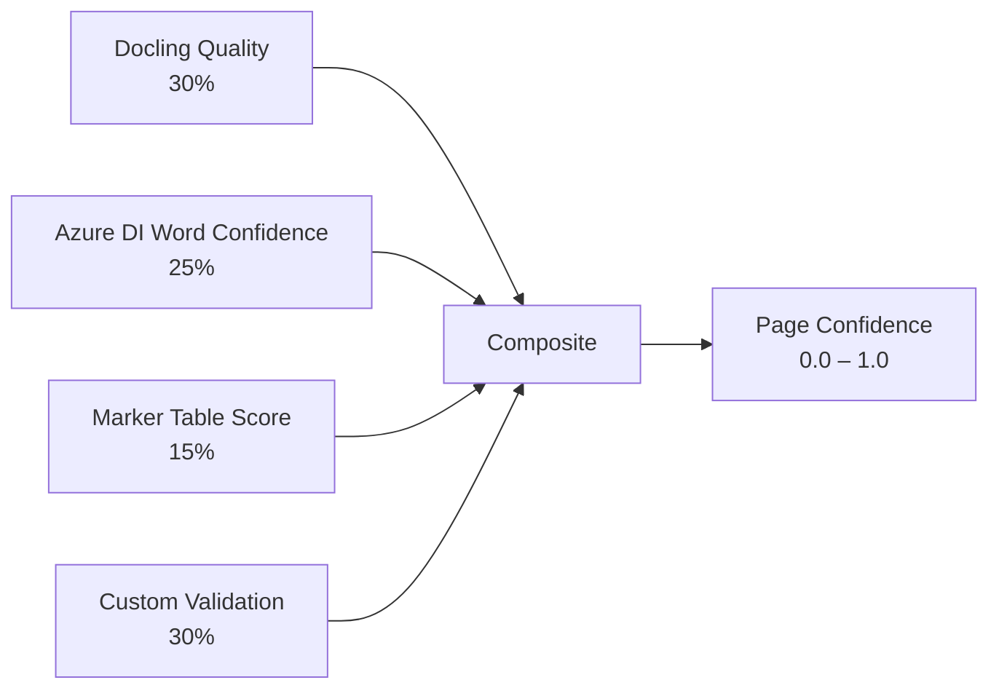

# Composite Confidence Scorer

> **Code reference:** [`backend/app/core/services/confidence.py`](../../../backend/app/core/services/confidence.py)

The composite confidence scorer solves a fundamental problem: **no single OCR engine provides a complete or reliable confidence signal**. By combining signals from multiple independent sources into a weighted composite, the system produces a score that accurately reflects how much trust should be placed in each page's extraction.

---

## The Problem

| Engine | Confidence Signal | Limitation |
|---|---|---|
| **LangExtract** | Hardcoded `1.0` | Useless — always reports perfect confidence |
| **Marker** | Table correction score (1–5) | Only available for pages with tables; no general OCR confidence |
| **Azure Document Intelligence** | Per-word confidence (0–1) | Word-level only; no page-level aggregation; misses structural issues |
| **Docling** | Quality sub-scores | Quality assessment, not OCR confidence per se |

No single signal is sufficient. A page might have high word-level confidence from Azure DI but contain a completely garbled table that only Marker's table score would catch — or vice versa.

---

## The Solution: Weighted Composite

The `CompositeConfidenceScorer` combines four independent signal sources into a single `[0, 1]` score per page:



---

## Signal Sources

### 1. Docling Quality (30% weight)

Docling produces a `PageQualityScore` with four sub-dimensions:

| Sub-score | What it measures |
|---|---|
| `layout_score` | Page layout detection accuracy |
| `table_score` | Table structure recognition |
| `ocr_score` | Character-level OCR quality |
| `parse_score` | Document parsing completeness |

These four sub-scores are **averaged** to produce a single Docling quality signal.

**Default when missing:** `0.5` (neutral — neither trusts nor distrusts the page).

### 2. Azure DI Word Confidence (25% weight)

Azure Document Intelligence returns a confidence value for every recognized word. The scorer takes the **minimum word confidence** on the page as the signal.

Using the minimum (rather than mean) is a conservative choice: if even one word on the page has low confidence, the overall score is dragged down. This is intentional for pharmaceutical documents where a single mis-read value can be critical.

**Default when missing:** `0.5`

### 3. Marker Table Score (15% weight)

Marker's table correction pipeline uses an LLM to rate table quality on a **1–5 scale**. The scorer normalizes this to `[0, 1]`:

```
table_norm = marker_table_score / 5.0
```

This signal only carries 15% weight because it is only relevant for pages containing tables. For pages without tables, the default applies.

**Default when missing:** `0.5`

### 4. Custom Validation (30% weight)

A set of domain-specific plausibility checks (see [Validation Rules](./validation-rules.md)) that catch logical errors no OCR engine would flag:

- Date plausibility
- Quantity range checks
- Content emptiness detection

The signal is the `pass_rate` — fraction of rules that passed.

**Default when missing:** `0.8` (optimistic default — assumes most pages are valid when validation hasn't run).

---

## Configurable Weights

Weights are encapsulated in a dataclass so they can be tuned without code changes:

```python
@dataclass
class CompositeConfidenceWeights:
    docling_mean: float = 0.30
    azure_di_min_word: float = 0.25
    marker_table: float = 0.15
    validation: float = 0.30
```

The weights sum to **1.0**. Adjusting them shifts how much influence each source has. For example, if Docling quality is found to be the most predictive signal in practice, its weight can be increased.

---

## Score Computation

```python
class CompositeConfidenceScorer:

    def score_page(
        self,
        docling_page: PageQualityScore | None = None,
        azure_di_word_confidences: list[float] | None = None,
        marker_table_score: int | None = None,
        validation_results: ValidationResults | None = None,
    ) -> float:

        docling_mean = mean(docling_page.scores) if docling_page else 0.5
        azure_min = min(azure_di_word_confidences) if azure_di_word_confidences else 0.5
        table_norm = (marker_table_score / 5.0) if marker_table_score else 0.5
        val_rate = validation_results.pass_rate if validation_results else 0.8

        score = (
            self.weights.docling_mean * docling_mean
            + self.weights.azure_di_min_word * azure_min
            + self.weights.marker_table * table_norm
            + self.weights.validation * val_rate
        )

        return round(min(max(score, 0.0), 1.0), 4)
```

The final score is clamped to `[0, 1]` and rounded to four decimal places.

### Example Calculations

| Scenario | Docling | Azure DI min | Marker table | Validation | **Composite** |
|---|---|---|---|---|---|
| Clean typed page | 0.95 | 0.98 | — (0.5) | 3/3 (1.0) | **0.93** |
| Handwritten page, poor scan | 0.40 | 0.55 | — (0.5) | 2/3 (0.67) | **0.52** |
| Good scan, garbled table | 0.85 | 0.92 | 2/5 (0.4) | 3/3 (1.0) | **0.85** |
| Nearly empty page | 0.50 | 0.50 | — (0.5) | 0/3 (0.0) | **0.38** |

---

## Classification Tiers

The scorer also classifies pages into confidence tiers used by [HITL routing](../workflow/hitl-flow.md):

```python
def classify_confidence(self, score: float) -> str:
    if score >= 0.9:
        return "high"
    if score >= 0.7:
        return "medium"
    return "low"
```

| Tier | Score Range | HITL Action |
|---|---|---|
| **high** | ≥ 0.9 | Auto-approve — no human review |
| **medium** | 0.7 – 0.9 | Batch review — lower-priority human review |
| **low** | < 0.7 | Review required — highest-priority human review |

---

## Integration Point

The composite scorer is called inside `merge_ocr_results` in the [document processing workflow](../workflow/document-processing.md) via the helper `_compute_page_confidence`:

```python
def _compute_page_confidence(quality_page, azure_page, marker_page) -> float:
    scorer = CompositeConfidenceScorer()
    return scorer.score_page(
        docling_page=quality_page,
        azure_di_word_confidences=azure_page.get("word_confidences"),
        marker_table_score=marker_page.get("table_score"),
        validation_results=validate_page_extraction(extraction),
    )
```

The resulting confidence scores are stored in `DocumentState.confidence_scores` (keyed by page number) and drive the `route_by_confidence` conditional edge.

---

## Related Documentation

- [Validation Rules](./validation-rules.md) — the custom checks that provide the 30% validation signal
- [Document Processing Workflow](../workflow/document-processing.md) — where the scorer is invoked
- [HITL Flow](../workflow/hitl-flow.md) — how confidence tiers drive human review routing
