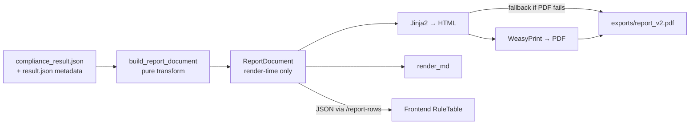

# Compliance Report Renderer (Spec 008)

> Back to [Wiki Index](../README.md) · See also [Compliance Review](./workflow/compliance-review.md), [VLM Provider](./vlm-provider.md)

The report renderer turns an internal [`ComplianceReport`](../../backend/app/compliance/models.py) into a **client-shareable** PDF / HTML / Markdown artifact. The exported document is intentionally **score-stripped** — operators see scores on screen, but every artifact handed to a client looks like the operator's existing reference PDF: a rule-centric, five-column table with three compliance states.

Scope is set by [Spec 008](../../specs/008-report-format-export/spec.md):

- **US1** — Operator downloads a PDF via `GET /api/compliance/{doc_id}/export?format=pdf`
- **US2** — On-screen rule-centric table replaces the old findings list
- **US3** (P2, implemented) — LLM-synthesised mitigation cache via `POST .../mitigation/synthesize`
- **US4** — Backward-compatible on-disk JSON (one additive field: `ComplianceFinding.mitigation_text`)

## Flow



The builder is a **pure transform** (no I/O). Tests can construct any `ComplianceReport` and assert against the resulting `ReportDocument` without touching the filesystem.

## Module layout

[`backend/app/compliance/report_renderer/`](../../backend/app/compliance/report_renderer/)

| File | Purpose |
|------|---------|
| `types.py` | Render-time dataclasses: `ReportRow`, `ReportHeader`, `ReportFooter`, `ReportStats`, `ReportDocument`. Never persisted — the mirror on the frontend is `frontend/src/types/report.ts`. |
| `builder.py` | `build_report_document(report, …) -> ReportDocument`. Excludes `not_applicable` rules (FR-007), applies HITL overrides, sorts rows (action_required → needs_attention → compliant). |
| `status_bucket.py` | Maps raw status + HITL into three buckets: **Compliant** (green) / **Action Required** (orange) / **Needs Attention** (amber). HITL `user_approved` flips `non_compliant` → `compliant`. |
| `page_formatter.py` | `[6,7,8,9,10,11,12,13]` → `"PAGE:6 to 13"`; `[6,9,31]` → `"PAGE:6, 9, 31"`. Contiguous runs ≥3 pages collapse to ranges. |
| `summary.py` | Detailed-Evidence text. Compliant rows get a boilerplate "Evaluated across N pages"; non-compliant concatenates finding reasoning + evidence. |
| `mitigation.py` | Mitigation text priority chain: `recommendation` (rule author) → `mitigation_text` (LLM cache) → boilerplate. Also hosts `synthesize_mitigations()` for the eager-warm endpoint. |
| `render_html.py` | Jinja2 renderer; embeds logo as base64 data URI so the output is fully self-contained. |
| `render_pdf.py` | WeasyPrint bridge; **lazy-imports** weasyprint so missing pango/cairo doesn't break module load. Raises `PdfRenderError` on failure (the caller falls back to HTML). |
| `render_md.py` | Markdown table renderer — operator fallback for environments without WeasyPrint. |
| `templates/report.html.j2` | Header (logo + brand + metadata table), 5-column rule table, Priority Actions, Key Risks & Strengths panels, footer disclaimer. |
| `templates/styles.css` | Print CSS: A4 portrait, `@page` margins, `@bottom-center` footer, table styling, three-state badge colours. |
| `assets/logo.svg` | Generic engine logo. Renderer degrades gracefully if missing. |

## Three-state taxonomy

| Bucket | Label | Colour | Drives from |
|--------|-------|--------|-------------|
| **Compliant** | "Compliant" | Green | `status=compliant`, or `non_compliant`/`uncertain` with HITL `user_approved` |
| **Action Required** | "Action Required" | Orange | `status=non_compliant` without HITL approval |
| **Needs Attention** | "Needs Attention" | Amber | `status=uncertain` or `error` |

`status=not_applicable` rules are **excluded** from the export entirely (FR-007).

## Five-column rule table

| Column | Compliant row | Non-compliant / uncertain row |
|--------|---------------|------------------------------|
| **Question** | Rule text (verbatim) | Rule text (verbatim) |
| **Compliance** | Green badge | Orange / amber badge |
| **Evidence From Document** | *(empty)* (FR-003) | `PAGE:6 to 13` style page refs |
| **Detailed Evidence** | "Evaluated across {N} pages…" boilerplate | Concatenated finding reasoning + evidence |
| **Mitigation** | "Not Applicable" | Picked from `recommendation` → `mitigation_text` → boilerplate |

Rows are deterministically ordered: `action_required` (priority 0) → `needs_attention` (1) → `compliant` (2), tie-broken by `(agent, rule_id)`.

## Report sections (top to bottom)

1. **Header band** — logo (28 × 14 mm, `object-fit: contain`), brand block, optional "DRAFT" flag.
2. **Report title** — derived from `document_type`: `batch_record` → "BMR Compliance Review", `checklist` → "Operation Checklist Review", default "Compliance Review".
3. **Metadata table** — Document (filename), Product, Batch No, Date Of Validation. Product / Batch No come from OCR `key_value_pairs` (see *Metadata extraction* below).
4. **Priority Actions** — high-impact remediation list from `ComplianceReport.executive_summary`. Skipped if empty.
5. **Rule table** — the five columns above.
6. **Key Risks & Strengths panels** — from `executive_summary`. Skipped if empty.
7. **Footer** (every page, `@bottom-center`) — "Disclaimer Note : This document is electronically generated by BMR Compliance Intelligence Printed By: {operator} Printed On: {timestamp}"

## API surface

[`backend/app/api/routes/compliance.py`](../../backend/app/api/routes/compliance.py)

| Method | Path | Returns | Notes |
|--------|------|---------|-------|
| `GET` | `/api/compliance/{doc_id}/export` | PDF / HTML / MD bytes | Query: `format=pdf\|html\|md` (default pdf), `agent=<name>`, `operator=<name>`, `nocache=1`. Response headers: `Content-Disposition: attachment`, `X-Cache: hit\|miss`, `X-Render-Fallback: html` (when PDF fails). |
| `GET` | `/api/compliance/{doc_id}/report-rows` | `ReportDocument` JSON | Feeds the on-screen rule table. No file caching (React Query handles it). |
| `GET` | `/api/compliance/{doc_id}/preview` | PDF bytes (inline) | Same as `/export?format=pdf` but `Content-Disposition: inline` so the frontend can embed it in an `<iframe>`. |
| `POST` | `/api/compliance/{doc_id}/mitigation/synthesize` | JSON `{count, cached_cost_usd, …}` | Eager-warm the LLM mitigation cache. Body: `{rule_ids?: [...], force?: bool}`. Atomic write-back to `compliance_result.json`. Returns 429 if the per-doc cost ceiling is breached. |
| `POST` | `/api/compliance/{doc_id}/findings/{finding_id}/review` | Updated HITL state JSON | HITL approve / reject / modify. Invalidates the export cache implicitly (touches `compliance_result.json`). |

### Metadata extraction

`compliance.py:_extract_doc_metadata()` reads `result.json`'s `key_value_pairs`, maps raw keys (`"product name"`, `"batch no"`, …) to canonical labels (`"Product"`, `"Batch No"`), and threads them into `build_report_document(metadata_overrides={...})`. **Earliest-page value wins** (cover sheet beats reprints).

## Cache strategy

```
backend/data/documents/{doc_id}/exports/
├── report_v2.pdf
├── report_v2.html
├── report_v2.md
└── report_v2_alcoa.pdf   # per-agent variant
```

| Concept | Value |
|---------|-------|
| Filename pattern | `report_{VERSION}[_{agent}].{ext}` |
| Version constant | `_RENDERER_CACHE_VERSION = "v2"` in `compliance.py` |
| Cache hit | `cache_file.mtime >= max(compliance_result.json.mtime, result.json.mtime)` |
| Cache bust | Bump `_RENDERER_CACHE_VERSION` (e.g. `v2` → `v3`) — old files become orphans, no cleanup needed |
| Bypass | `?nocache=1` query param |

The version-in-filename pattern means renderer bugs (e.g. PR #67 logo resolution, PR #68 broken-image fallback) get fixed without serving anyone a stale broken PDF — the version bump auto-orphans the cache.

### Render fallback

PDF render errors (missing pango/cairo on the host, font issue, anything from WeasyPrint) trigger HTML fallback:

1. `render_pdf()` raises `PdfRenderError`
2. Caller re-renders via `render_html()`
3. Atomic-write to the **same versioned cache path** but with `.html` extension
4. Response carries `X-Render-Fallback: html` so the frontend can show an info banner

CI installs WeasyPrint native deps explicitly (`libpango-1.0-0`, `libpangoft2-1.0-0`, `libcairo2`, `libgdk-pixbuf-2.0-0`) so the full suite stays green; see [GitHub Actions CI](../devops/github-actions-ci.md).

## Frontend integration

[`frontend/src/components/compliance/`](../../frontend/src/components/compliance/)

| Component | What it does |
|-----------|--------------|
| `compliance-report.tsx` | Page-level layout. Keeps the score-rich `AgentScorecard` + `ExecutiveSummary` at the top; swaps `FindingsTable` for `RuleTable`. Adds Export dropdown + Preview button. |
| `rule-table.tsx` | Fetches `/report-rows`; filters by compliance kind; refetches on HITL state change. |
| `rule-row.tsx` | One row; clickable to expand. |
| `rule-expand-drawer.tsx` | Per-finding detail panel; HITL controls (approve / reject / modify). |
| `compliance-badge.tsx` | Three-state badge (Compliant / Action Required / Needs Attention). Same visual taxonomy as the PDF. |
| `report-preview-iframe.tsx` | Modal that `<iframe>`-embeds `/preview`. Lazily mounted on dialog open. |
| `agent-scorecard.tsx` / `executive-summary.tsx` | **Unchanged** — score panels stay on screen, never in the export. |

### Export trigger

The user clicks the **Export** dropdown on `compliance-report.tsx` → `downloadComplianceExport(docId, format)` → `GET /export?format=…`. The Export dropdown is at the page level (not per agent card) so single-agent / multi-agent views produce consistent artifacts.

> Responsive note: the agent-card export buttons on the segmentation/compliance progress views were re-laid out in PR #66 to stay inside the card on narrow viewports.

## Tests

[`backend/tests/compliance/report_renderer/`](../../backend/tests/compliance/report_renderer/)

| File | What it pins |
|------|--------------|
| `test_status_bucket.py` | Status → bucket mapping; HITL overrides (user_approved flips, auto_approved doesn't); badge labels match the reference verbatim; sort priorities. |
| `test_page_formatter.py` | Page formatting: empty → `""`, single → `"PAGE:103"`, sparse → `"PAGE:6, 9, 31"`, contiguous ≥3 → `"PAGE:36 to 42"`, mixed → `"PAGE:1, 5 to 10"`. |
| `test_builder.py` | Compliant row shape (empty pages, summary evidence, "Not Applicable" mitigation); non-compliant row shape; `not_applicable` exclusion; ordering; metadata overrides. |
| `test_renderers.py` | HTML has 5 columns in order; PDF text (via pypdf) contains no `overall_score` / `model_score` substrings (FR-007); Markdown table shape. |

Pinned invariants:

- No score fields in any rendered output
- Compliant rows: `evidence_pages == ""` and `mitigation == "Not Applicable"`
- Non-compliant / uncertain: `evidence_pages` populated, `mitigation` from the priority chain
- Badge labels match the operator's reference document verbatim
- Round-trip equality: every rule in the JSON appears in the PDF (excluding `not_applicable`), in the expected bucket

## Recent fixes

| Commit | Fix |
|--------|-----|
| `b0d2604` | Bump `_RENDERER_CACHE_VERSION` to `v2` so logo / broken-image fixes auto-invalidate stale exports |
| `8e315b1` | Resolve logo path against multiple anchors (CWD-relative, repo-root, backend-root); suppress `` fallback when the asset is missing |
| `fbb7dc5` | Populate Product / Batch No header from OCR `result.json` `key_value_pairs` (earliest page wins) |
| `951ee8b` | On-screen rule table + preview iframe (Spec 008 US2) |
| `1b5a3c0` | LLM mitigation synthesis + report preview (Spec 008 US3) |
| `03fcf71` | Surface executive-summary panels (Priority Actions, Key Risks, Strengths) in the export |

## Spec

[`specs/008-report-format-export/spec.md`](../../specs/008-report-format-export/spec.md) — full functional requirements, user stories, and constraint tables.

## Related Pages

- [Compliance Review](./workflow/compliance-review.md) — How the rule findings get into `ComplianceReport`
- [Document Segmentation & BPCR Detection](./workflow/segmentation.md) — How pages are split before rules run
- [VLM Provider](./vlm-provider.md) — Where visual findings come from
- [GitHub Actions CI](../devops/github-actions-ci.md) — WeasyPrint native-deps installation step
