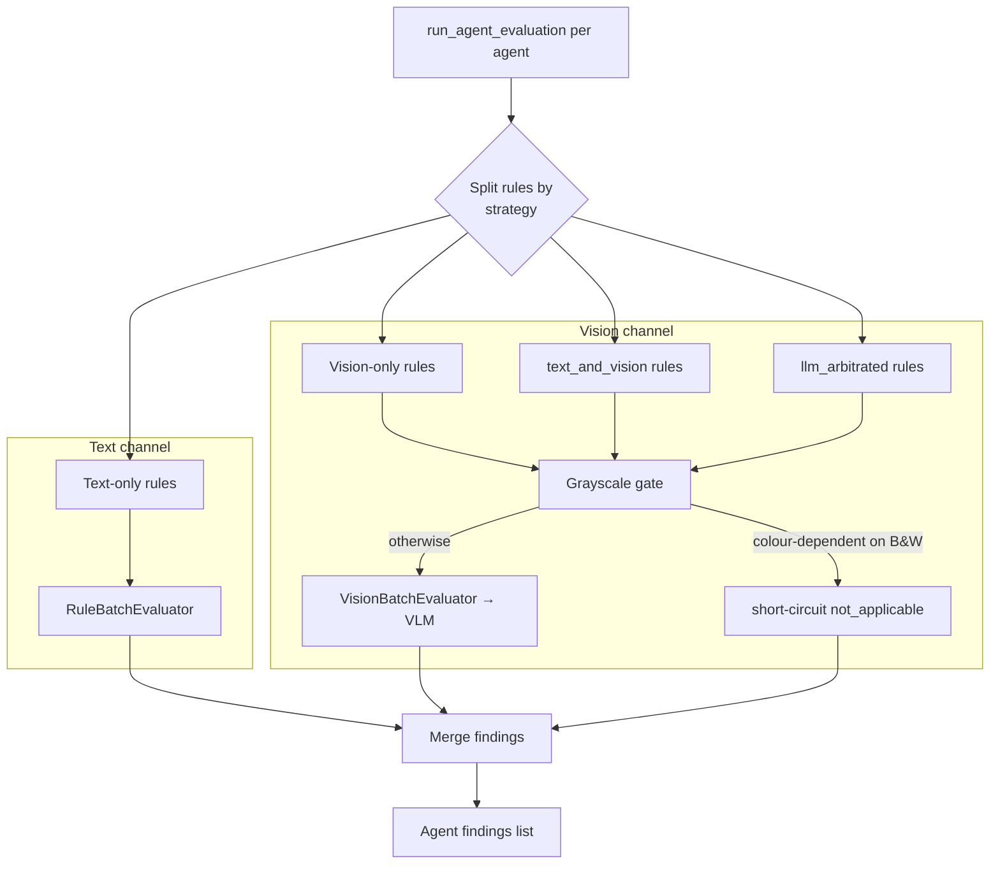

# VLM Provider

> Back to [Wiki Index](../README.md) · See also [Ports & Adapters](../architecture/ports-and-adapters.md), [Compliance Review](./workflow/compliance-review.md)

The **VLM (Vision-Language Model) provider** lets the compliance engine inspect rendered page images directly — for checks that text-only OCR can't answer (strikethroughs, wet-ink signatures, ink colour, stamps, white-out, blank fields, …). It is a first-class hexagonal port with two interchangeable adapters: **Gemini** (cloud) and **vLLM-served OpenAI-compatible** (on-prem).

VLM is **off by default**. Two settings gate it: `AT_VLM__ENABLED` and `AT_COMPLIANCE__VLM_EVALUATION_ENABLED` — both must be true before any vision call runs.

## Port contract

```python
# backend/app/core/ports/vlm.py
class VLMProvider(Protocol):
    async def analyze_image(
        self,
        image: bytes,
        prompt: str,
        *,
        system: str | None = None,
        mime_type: str = "image/png",
    ) -> str: ...

    async def analyze_image_structured(
        self,
        image: bytes,
        prompt: str,
        schema: type[BaseModel],
        *,
        system: str | None = None,
        mime_type: str = "image/png",
    ) -> BaseModel: ...

    def supports_structured_output(self) -> bool: ...
    def max_image_resolution(self) -> tuple[int, int]: ...
```

The structured-output method is the hot path — the compliance engine almost always sends a Pydantic schema (`VisionBatchResult`) so the VLM emits a strict JSON shape it can merge with text findings.

## Adapters

| File | Adapter | Where it runs | Structured output |
|------|---------|---------------|-------------------|
| [`backend/app/adapters/vlm/gemini.py`](../../backend/app/adapters/vlm/gemini.py) | `GeminiVLMAdapter` | Google Generative Language API (cloud) | Native via `response_schema` |
| [`backend/app/adapters/vlm/vllm_openai.py`](../../backend/app/adapters/vlm/vllm_openai.py) | `VLLMOpenAIVLMAdapter` | Any vLLM container or OpenAI-compatible endpoint (Qwen3-VL, InternVL3, LMDeploy, …) | Native via `response_format` / `json_schema` |

Both adapters share the same patterns:

- **PIL resize on-the-fly** so the request stays under the configured `max_image_width / max_image_height` (default 2048 × 2048).
- **Retry with exponential backoff**: up to 4 retries on transient errors (`429`, `503`, `resource_exhausted`) with 1–30 s waits.
- **Rate limiting**: `max_rpm` (default 60) tracked via a sliding-window timestamp list; `max_concurrent` (default 5) enforced via `asyncio.Semaphore`.
- **Fail-fast validation at init**: Gemini rejects placeholder / truncated / sub-20-char API keys with an actionable error. vLLM defaults `api_key="EMPTY"` for unauthenticated local deployments.

## Configuration

All VLM settings live under `AT_VLM__*` (see `VLMConfig` in [`backend/app/config/settings.py`](../../backend/app/config/settings.py)):

| Setting | Env var | Default | Purpose |
|---------|---------|---------|---------|
| `enabled` | `AT_VLM__ENABLED` | `false` | Master gate. If false, `container.vlm` returns `None`. |
| `provider` | `AT_VLM__PROVIDER` | `gemini` | `gemini` or `vllm` |
| `gemini_api_key` | `AT_VLM__GEMINI_API_KEY` | — | Required when provider=gemini |
| `gemini_model` | `AT_VLM__GEMINI_MODEL` | `gemini-2.5-flash` | Gemini model id |
| `vllm_base_url` | `AT_VLM__VLLM_BASE_URL` | `http://localhost:8200/v1` | vLLM OpenAI-compatible endpoint |
| `vllm_model` | `AT_VLM__VLLM_MODEL` | `Qwen/Qwen3-VL-8B-Instruct` | vLLM-hosted model id |
| `vllm_api_key` | `AT_VLM__VLLM_API_KEY` | `EMPTY` | Bearer token if vLLM is auth-gated |
| `max_image_width` / `max_image_height` | `AT_VLM__MAX_IMAGE_WIDTH` / `AT_VLM__MAX_IMAGE_HEIGHT` | `2048` | Resize ceiling |
| `image_format` | `AT_VLM__IMAGE_FORMAT` | `png` | `png` or `jpeg` |
| `jpeg_quality` | `AT_VLM__JPEG_QUALITY` | `95` | When image_format=jpeg |
| `render_scale` | `AT_VLM__RENDER_SCALE` | `2.0` | PDF→PNG raster scale |
| `store_page_images` | `AT_VLM__STORE_PAGE_IMAGES` | `true` | Cache rendered pages to disk |
| `max_rpm` | `AT_VLM__MAX_RPM` | `60` | Rate limit |
| `max_concurrent` | `AT_VLM__MAX_CONCURRENT` | `5` | Concurrency cap |

A second gate lives on the compliance config (`AT_COMPLIANCE__VLM_EVALUATION_ENABLED`) — both must be true. The dual gate exists so ops can enable the VLM provider for one-off experiments without it suddenly affecting every compliance run.

## DI wiring

```python
# backend/app/config/container.py
def create_vlm_provider(settings: AppSettings | None = None) -> VLMProvider:
    settings = settings or get_settings()
    match settings.vlm.provider:
        case "gemini":
            from app.adapters.vlm.gemini import GeminiVLMAdapter
            return GeminiVLMAdapter(settings.vlm)
        case "vllm":
            from app.adapters.vlm.vllm_openai import VLLMOpenAIVLMAdapter
            return VLLMOpenAIVLMAdapter(settings.vlm)
        case _:
            raise ValueError(f"Unknown VLM provider: {settings.vlm.provider}")

# On Container:
@property
def vlm(self) -> VLMProvider | None:
    """VLM provider, or ``None`` when VLM is disabled."""
    if not self._vlm_checked:
        self._vlm_checked = True
        if self._settings.vlm.enabled:
            self._vlm_provider = create_vlm_provider(self._settings)
    return self._vlm_provider
```

The property is lazy and singletoned per-process. Returning `None` when disabled means downstream call sites can write `if vlm:` once and the engine reduces to text-only naturally.

## Flow: where the VLM is called



### Strategy routing

Every rule declares an `evaluation_strategy` in its YAML definition. The evaluator routes accordingly:

| Strategy | Behaviour |
|----------|-----------|
| `text` (default) | Text channel only |
| `vision` | Vision channel only |
| `text_and_vision` | Both channels; results merged |
| `text_primary` | Text first; vision used as secondary signal if text uncertain |
| `llm_arbitrated` | Both channels; an LLM picks the more confident signal |

### Grayscale pre-flight gate

Before any VLM call, [`vision_evaluator.py:image_has_meaningful_colour()`](../../backend/app/compliance/vision_evaluator.py) inspects the rendered page. If the image is grayscale (1-channel L-mode, or RGB with R=G=B across the frame), colour-dependent checks (`VC-INK-COLOR`) short-circuit to `not_applicable` and never reach the VLM. This is the single biggest cost-and-FP-reduction hook in the pipeline — most pharmaceutical PDFs are scanned B&W.

### Per-rule visual checks

The vision evaluator owns 14 `VC-*` prompt templates (`vision_evaluator.py:_VC_PROMPTS`) — one per visual capability:

| Check | Capability | Example rules |
|-------|------------|---------------|
| `VC-STRIKE` | Strikethrough detection (initials+date hygiene) | ALC-ATT6, GMP-COR14 |
| `VC-SIGNATURE` | Wet-ink vs typed vs stamp classification | ALC-ATT1, CHE-SIG5–9 |
| `VC-INK-COLOR` | Ink colour (blue/black/red/pencil) | ALC-LEG22 |
| `VC-CORRECTION` | White-out / erasure / overwrite | GMP-COR17 |
| `VC-STAMP-SEAL` | Stamps / seals / watermarks (ORIGINAL, COPY, …) | ALC-ORI34 |
| `VC-ATTACHMENT` | Physical attachments + integrity | ALC-LEG18, CHE-ATT19 |
| `VC-BARCODE` | Barcode legibility | ALC-LEG20 |
| `VC-BLANK-FIELD` | Truly blank fields vs `N/A` / dashes | ALC-COM52 |
| `VC-DOC-QUALITY` | Smudges, fading, tears, scanner defects | ALC-LEG16 |
| `VC-CHART` | Chart/graph completeness | ALC-LEG24 |
| `VC-CHROMATOGRAM` | Spectra / chromatogram integrity | ALC-ORI41 |
| `VC-CHECKBOX` | Tickbox coverage (coarse buckets, not exact counts — VLMs are unreliable at counting) | CHE-CHE1 |
| `VC-PAGINATION` | Page X of Y legibility | ALC-LEG19 |
| `VC-STICKY-NOTE` | Temporary annotations / sticky notes / non-template DRAFT watermarks | ALC-LEG17 |

### "Absence first" prompt discipline

Every high-FP-risk prompt and the system prompt embed a hard rule:

> When a rule asks about a defect and you DO NOT see clear visual evidence, the correct status is `compliant` — NOT `non_compliant`.

Combined with a confidence-to-status mapping:

| Confidence | Status |
|-----------|--------|
| ≥ 0.85 | `non_compliant` |
| 0.60–0.85 | `uncertain` (for LLM arbitration / HITL) |
| < 0.60 | `compliant` |

This is pinned by [`backend/tests/compliance/test_vlm_prompt_hardening.py`](../../backend/tests/compliance/test_vlm_prompt_hardening.py) — the prompt asserts the FP-prevention clauses, the confidence mapping, and the grayscale guard.

## Page-image pipeline

The VLM consumes pre-rendered page PNGs. [`backend/app/compliance/page_image_loader.py`](../../backend/app/compliance/page_image_loader.py) provides:

- **`load_page_image(doc_id, page_num, vlm_config)`** — disk-cache hit at `{doc_dir}/page_images/page_NNN.png`; on miss, rasterises from the original PDF via `pypdfium2` at `vlm_config.render_scale` (default 2×) and optionally caches.
- **`ensure_page_images(doc_id, total_pages)`** — bulk pre-render before a compliance run (warm cache).

```
backend/data/documents/{doc_id}/
└── page_images/
    ├── page_001.png
    ├── page_002.png
    └── …
```

## Output shape

```python
class VisualRegion(BaseModel):
    x: float = 0.0      # normalised 0–1
    y: float = 0.0
    width: float = 0.0
    height: float = 0.0
    label: str = ""

class VisualCheckResult(BaseModel):
    check_id: str = ""           # e.g. "VC-STRIKE"
    detected: bool = False
    classification: str = ""     # e.g. "single-line", "red-ink"
    confidence: float = 0.0
    description: str = ""
    regions: list[VisualRegion] = []

class VisionBatchResult(BaseModel):
    page_num: int = 0
    checks: list[VisualCheckResult] = []
    rule_evaluations: list[RuleEvaluation] = []
```

Bounding boxes are **normalised 0–1** so the frontend can render them on whatever canvas size it likes. The frontend's [`visual-evidence-viewer.tsx`](../../frontend/src/components/compliance/visual-evidence-viewer.tsx) reads these directly and overlays them with zoom / pan controls.

## Frontend consumption

- [`visual-evidence-viewer.tsx`](../../frontend/src/components/compliance/visual-evidence-viewer.tsx): modal viewer that fetches the page image via `getPageImageUrl(docId, pageNum)`, draws bounding boxes from `VisualRegion[]`, and supports 0.5×–3× zoom + reset.
- Findings table chips: each finding row shows a small `Eye` icon if visual evidence is attached; clicking opens the viewer.

## Tests

| File | Pins |
|------|------|
| [`test_vlm_grayscale_gate.py`](../../backend/tests/compliance/test_vlm_grayscale_gate.py) | L-mode + RGB-with-equal-channels detected as grayscale; saturated colour passes through; corrupt bytes fail-open to colour (no silent disabling); ink-colour rule short-circuits on B&W but non-colour rules still reach the VLM. |
| [`test_vlm_prompt_hardening.py`](../../backend/tests/compliance/test_vlm_prompt_hardening.py) | All high-FP checks carry "ABSENCE FIRST"; VC-CORRECTION names common FP sources (toner, JPEG); VC-ATTACHMENT blocks speculative findings; VC-CHECKBOX uses coarse buckets not exact counts; system prompt carries absence default + confidence mapping. |

## Spec

[`specs/vlm-visual-compliance-spec.md`](../../specs/vlm-visual-compliance-spec.md) — full architecture, rule inventory (Tier 1 vs Tier 2 vision needs), evaluation strategies, cost estimates. Status: Phase 1–2 + 4 implemented; Phase 3 + 5 deferred.

## Related Pages

- [Ports & Adapters](../architecture/ports-and-adapters.md) — Hexagonal architecture overview
- [Compliance Review](./workflow/compliance-review.md) — Where VLM slots into the compliance subgraph
- [Settings](./configuration/settings.md) — Full configuration reference
- [Report Renderer](./report-renderer.md) — How visual findings surface in the exported PDF
