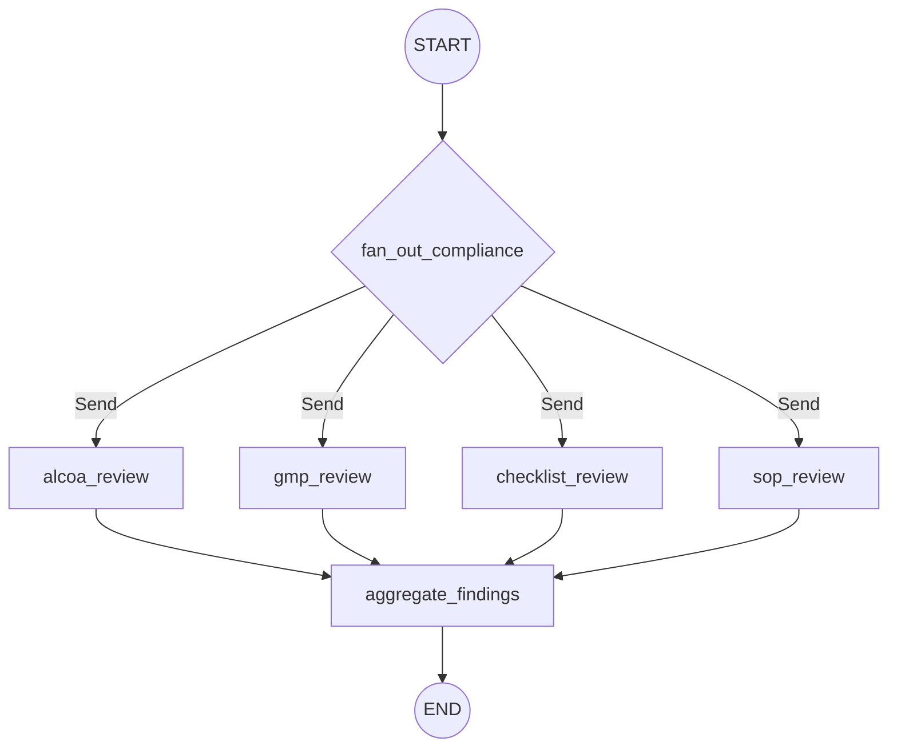

# Compliance Review Subgraph

> **Code references:** [`backend/app/workflow/compliance_graph.py`](../../../backend/app/workflow/compliance_graph.py), [`backend/app/compliance/alcoa.py`](../../../backend/app/compliance/alcoa.py), [`backend/app/compliance/gmp.py`](../../../backend/app/compliance/gmp.py), [`backend/app/compliance/checklist.py`](../../../backend/app/compliance/checklist.py), [`backend/app/compliance/sop.py`](../../../backend/app/compliance/sop.py)

The compliance review subgraph performs automated regulatory compliance analysis on digitized pharmaceutical documents. It runs **four specialised AI agents in parallel** — each targeting a different compliance domain — then aggregates their findings into a single scored report. The capability set is designed to match and augment Pharmix AI's compliance review features.

---

## Graph Structure



The entry node `fan_out_compliance` uses LangGraph's `Send` API to dispatch all four agents concurrently:

```python
async def fan_out_compliance(state: ComplianceState) -> list[Send]:
    return [
        Send("alcoa_review", state),
        Send("gmp_review", state),
        Send("checklist_review", state),
        Send("sop_review", state),
    ]
```

---

## State Definition

```python
class ComplianceState(TypedDict):
    doc_id: str
    extractions: list            # page extractions from the document workflow
    sections: list               # document sections

    alcoa_findings: Annotated[list, _merge_lists]
    gmp_findings: Annotated[list, _merge_lists]
    checklist_findings: Annotated[list, _merge_lists]
    sop_findings: Annotated[list, _merge_lists]

    aggregated_findings: list    # combined findings from all agents
    compliance_score: float | None  # 0–100 deductive score
```

Each agent writes to its own `*_findings` key using the `_merge_lists` reducer, so parallel writes are safely merged when the graph joins at `aggregate_findings`.

---

## Compliance Agents

All four agents follow the same pattern:

1. Accept the full `ComplianceState`.
2. Iterate over `extractions` (one per page).
3. Send each page's markdown (truncated to 4 000 chars) to the LLM via the **`LLMProvider` port** (Ollama adapter in the current stack).
4. Parse the LLM response into `ComplianceFinding` objects.
5. Return findings under their dedicated state key.

### Finding Data Model

```python
@dataclass
class ComplianceFinding:
    rule_id: str          # e.g. "ALCOA-3", "GMP-P5", "CHK-P2", "SOP-P7"
    rule_category: str    # "alcoa", "gmp", "checklist", "sop"
    severity: str         # "critical" | "major" | "minor" | "observation"
    page_num: int | None
    description: str
    recommendation: str
```

### ALCOA++ Agent

> `backend/app/compliance/alcoa.py` — class `ALCOAAgent`

Reviews documents against the **nine ALCOA++ principles**:

| # | Principle | Focus |
|---|---|---|
| 1 | **Attributable** | Every entry traceable to a person |
| 2 | **Legible** | Readable, permanent, no ambiguity |
| 3 | **Contemporaneous** | Recorded at the time of the activity |
| 4 | **Original** | First-capture or certified true copy |
| 5 | **Accurate** | No errors, corrections follow procedure |
| 6 | **Complete** | All data present, no deletions |
| 7 | **Consistent** | Logical sequencing, no contradictions |
| 8 | **Enduring** | Durable recording medium |
| 9 | **Available** | Retrievable for the full retention period |

- **System prompt:** `"You are a pharmaceutical compliance expert specializing in ALCOA++ data integrity."`
- **Rule IDs:** `ALCOA-{n}` where `n` is an incrementing counter.
- **Parsing:** Line-by-line extraction of principle name, severity, description, and recommendation from the LLM response.

### GMP Agent

> `backend/app/compliance/gmp.py` — class `GMPAgent`

Reviews Good Manufacturing Practice documentation requirements:

- Equipment identification and calibration records
- SOP references and revision numbers
- Environmental monitoring conditions
- Correction and change-control procedures
- Material reconciliation and yield calculations
- In-process control documentation

- **System prompt:** `"You are a pharmaceutical GMP compliance expert."`
- **Rule IDs:** `GMP-P{page_num}`
- **Default severity:** `observation`

### Checklist Agent

> `backend/app/compliance/checklist.py` — class `ChecklistAgent`

Auto-verifies checklist completeness on batch manufacturing records:

- All checklist items marked (checked / initialled)
- Signatures present where required
- Dates filled in on every step
- No blank mandatory fields

- **System prompt:** `"You are a pharmaceutical documentation checklist reviewer."`
- **Rule IDs:** `CHK-P{page_num}`
- **Default severity:** `major` (missing checklist items are a significant finding)

### SOP Agent

> `backend/app/compliance/sop.py` — class `SOPAgent`

Compares manufacturing execution records against Standard Operating Procedures:

- SOP references cited correctly
- Procedural steps align with the referenced SOP revision
- Deviations documented and deviation reports referenced
- No undocumented departures from procedure

- **System prompt:** `"You are a pharmaceutical SOP compliance expert."`
- **Rule IDs:** `SOP-P{page_num}`
- **Default severity:** `observation`

---

## Findings Aggregation and Scoring

The `aggregate_findings` node collects all four agent outputs and computes a **deductive compliance score**:

```python
async def aggregate_findings(state: ComplianceState) -> dict:
    all_findings = (
        state.get("alcoa_findings", [])
        + state.get("gmp_findings", [])
        + state.get("checklist_findings", [])
        + state.get("sop_findings", [])
    )
    score = _compute_compliance_score(all_findings)
    return {"aggregated_findings": all_findings, "compliance_score": score}
```

### Severity Weights

| Severity | Deduction per finding |
|---|---|
| `critical` | **10** points |
| `major` | **5** points |
| `minor` | **2** points |
| `observation` | **1** point |

The score starts at **100** and each finding deducts its severity weight. The floor is **0**:

```
compliance_score = max(0, 100 - sum(weight[f.severity] for f in findings))
```

A document scoring **90+** has only minor or observational issues. A score below **70** indicates systemic compliance gaps requiring immediate remediation.

---

## Invocation from the Main Document Graph

The compliance subgraph is built separately via `build_compliance_graph()` and can be invoked as a subgraph or called from an API endpoint after the document workflow completes. It requires the `extractions` and `sections` produced by the main [document processing workflow](./document-processing.md):

```python
compliance_graph = build_compliance_graph(checkpointer=checkpointer)
result = await compliance_graph.ainvoke({
    "doc_id": doc_id,
    "extractions": extractions,
    "sections": sections,
})
```

The compliance graph uses the same checkpointer pattern as the document graph (`MemorySaver` by default, `PostgresSaver` for production).

---

## VLM Visual Compliance (Cross-Cutting)

When `vlm.enabled = true`, rules tagged with `evaluation_strategy: vision` or `text_and_vision` are additionally evaluated by a Vision Language Model against page raster images. This runs **in parallel** with the text-based evaluation above.

Visual checks include: strikethrough detection, signature verification, ink color classification, correction fluid detection, stamp/seal detection, barcode quality, chart label verification, and more (14 visual check types).

Results from text and vision evaluators are merged:
- **Status**: the more severe result wins
- **Confidence**: the lower confidence wins (conservative)
- **Evidence**: both text and visual evidence are preserved with channel prefixes

See [VLM Visual Compliance Spec](../../../specs/vlm-visual-compliance-spec.md) for full details.

## Related Documentation

- [Document Processing Workflow](./document-processing.md) — the parent graph that produces extractions
- [HITL Flow](./hitl-flow.md) — human review of OCR results (upstream of compliance)
- [Composite Confidence Scorer](../confidence-scoring/composite-scorer.md) — OCR confidence (separate from compliance score)
- [VLM Visual Compliance Spec](../../../specs/vlm-visual-compliance-spec.md) — visual compliance via page images
