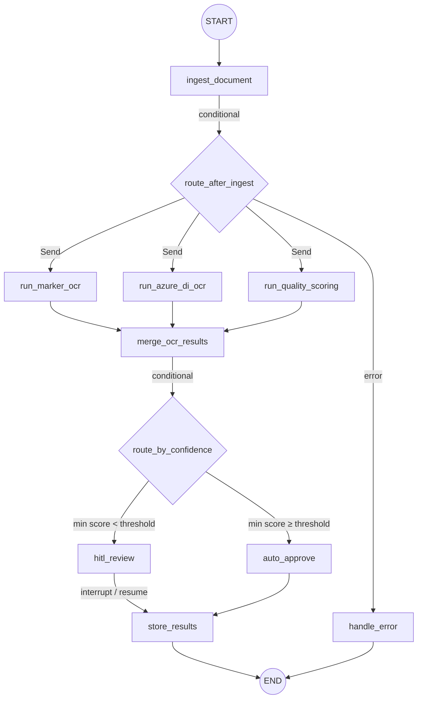
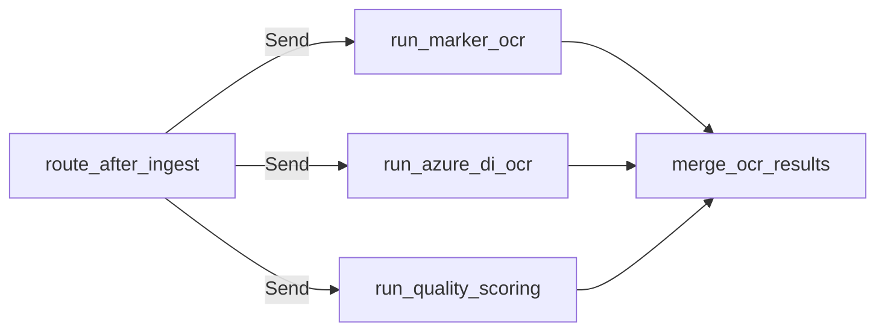

# Document Processing Workflow

> **Code references:** [`backend/app/workflow/document_graph.py`](../../../backend/app/workflow/document_graph.py), [`backend/app/workflow/nodes.py`](../../../backend/app/workflow/nodes.py), [`backend/app/workflow/state.py`](../../../backend/app/workflow/state.py)

The document processing workflow is the core pipeline of the Auto Transcription system. It is implemented as a **LangGraph StateGraph** that ingests a pharmaceutical PDF, runs it through multiple OCR engines in parallel, scores quality, merges results, and routes pages for human review or automatic approval based on composite confidence.

---

## Graph Overview



---

## State Definition

The workflow operates on `DocumentState`, a `TypedDict` with annotated reducers so that parallel branches can merge their outputs without overwriting each other.

```python
class DocumentState(TypedDict):
    # Identity
    doc_id: str
    pdf_path: str
    filename: str
    total_pages: int

    # Per-engine OCR results (merge via dict update)
    marker_results: Annotated[dict, _merge_dicts]
    azure_di_results: Annotated[dict, _merge_dicts]
    quality_scores: dict

    # Merged outputs (merge via list append / dict update)
    extractions: Annotated[list, _merge_lists]
    confidence_scores: Annotated[dict, _merge_dicts]
    page_classifications: Annotated[dict, _merge_dicts]

    # Document structure
    sections: list
    raw_markdown: Annotated[dict, _merge_dicts]

    # HITL
    hitl_pages_for_review: list
    hitl_decisions: Annotated[list, _merge_lists]

    # Control
    status: str
    error: str | None
```

### Reducers

| Reducer | Behaviour |
|---|---|
| `_merge_lists(left, right)` | Appends `right` to `left` — used for `extractions`, `hitl_decisions` |
| `_merge_dicts(left, right)` | Shallow-merges `right` into `left` — used for per-page result dicts |

The reducers are critical for the parallel fan-out pattern: when `run_marker_ocr`, `run_azure_di_ocr`, and `run_quality_scoring` complete concurrently, each writes to a different state key and the reducers ensure no data is lost during the join at `merge_ocr_results`.

A secondary state `PageProcessingState` (with `doc_id`, `pdf_path`, `page_num`) is defined for future per-page Send parallelism.

---

## Node Descriptions

### `ingest_document`

```python
async def ingest_document(state: DocumentState) -> dict
```

- **Validates** the PDF at `state["pdf_path"]` using PyMuPDF (`fitz`).
- **Counts pages** and sets `total_pages`.
- **Notifies the frontend** via `container.notification.send_update(doc_id, {"status": "ingested", ...})`.
- Returns `{"total_pages": n, "status": "ingested"}`.
- On a missing or corrupt PDF, returns `{"status": "error", "error": "..."}`.

### `run_marker_ocr`

```python
async def run_marker_ocr(state: DocumentState) -> dict
```

- Calls the **primary OCR port** via `container.primary_ocr.extract(pdf_path)` (Marker adapter).
- Builds per-page markdown and word-count dictionaries.
- Returns `{"marker_results": {...}, "raw_markdown": {...}, "status": "marker_ocr_complete"}`.

### `run_azure_di_ocr`

```python
async def run_azure_di_ocr(state: DocumentState) -> dict
```

- Calls the **secondary OCR port** via `container.secondary_ocr.extract(pdf_path)` (Azure Document Intelligence adapter).
- Computes per-page word confidence and handwriting statistics.
- Returns `{"azure_di_results": {...}, "status": "azure_di_ocr_complete"}`.

### `run_quality_scoring`

```python
async def run_quality_scoring(state: DocumentState) -> dict
```

- Calls the **quality scorer port** via `container.quality_scorer.score(pdf_path)` (Docling adapter).
- Returns `{"quality_scores": {...}, "status": "quality_scoring_complete"}`.

### `merge_ocr_results`

```python
async def merge_ocr_results(state: DocumentState) -> dict
```

- Iterates over all pages and merges outputs from Marker, Azure DI, and Docling.
- Calls the internal helper `_compute_page_confidence(quality_page, azure_page, marker_page)` per page to produce a weighted **composite confidence score** (see [Composite Scorer](../confidence-scoring/composite-scorer.md)).
- Returns `{"extractions": [...], "confidence_scores": {...}, "status": "merged"}`.

### `hitl_review`

```python
async def hitl_review(state: DocumentState) -> dict
```

- Identifies pages whose confidence falls below `settings.hitl.review_threshold`.
- Sends `hitl_required` status to the frontend via WebSocket.
- Calls **`interrupt()`** — the LangGraph native HITL primitive — to pause the workflow and yield a review payload to the frontend.
- When the human resumes via `Command(resume=feedback)`, returns `{"hitl_decisions": [...], "status": "reviewed"}`.
- Full details in [HITL Flow](./hitl-flow.md).

### `auto_approve`

```python
async def auto_approve(state: DocumentState) -> dict
```

- Sends `auto_approved` status to the frontend via WebSocket.
- Returns `{"status": "approved"}`.

### `store_results`

```python
async def store_results(state: DocumentState) -> dict
```

- Creates a `DigitalDocument` domain model from the final state.
- Persists via `document_store.save_document(...)`.
- Sends `completed` status to the frontend via WebSocket.
- Returns `{"status": "completed"}`.

### `handle_error`

```python
async def handle_error(state: DocumentState) -> dict
```

- Sends the error payload to the frontend via WebSocket.
- Returns `{"status": "error"}`.

---

## Parallel Execution

The fan-out after ingestion uses LangGraph's **`Send` API**:

```python
async def route_after_ingest(state: DocumentState) -> list[Send]:
    if state.get("status") == "error":
        return [Send("handle_error", state)]
    return [
        Send("run_marker_ocr", state),
        Send("run_azure_di_ocr", state),
        Send("run_quality_scoring", state),
    ]
```

LangGraph schedules all three OCR/quality nodes concurrently. Each writes to a distinct state key (`marker_results`, `azure_di_results`, `quality_scores`) with annotated reducers, so they merge cleanly when the graph joins at `merge_ocr_results`.



---

## Conditional Routing

After merging, the graph evaluates `route_by_confidence`:

```python
def route_by_confidence(state: DocumentState) -> str:
    scores = state.get("confidence_scores", {})
    if not scores:
        return "hitl_review"
    min_score = min(scores.values())
    if min_score < settings.hitl.review_threshold:
        return "hitl_review"
    return "auto_approve"
```

The threshold is configurable via `settings.hitl.review_threshold` (default `0.9`). If **any** page falls below it, the entire document is routed to human review.

---

## Streaming to Frontend

The workflow does **not** use LangGraph's `astream()` for frontend communication. Instead, each node pushes status updates directly through the **notification port**:

```
Node → container.notification.send_update(doc_id, payload)
     → WebSocketNotifyAdapter
     → ConnectionManager.broadcast(channel, data)
     → WebSocket clients
```

This gives fine-grained control over what the frontend receives at each stage (`ingested`, `marker_ocr_running`, `hitl_required`, `completed`, etc.) without coupling the frontend to LangGraph's internal event stream.

---

## Checkpointing

The graph is compiled with an optional checkpointer:

```python
def build_document_graph(checkpointer=None):
    # ... graph construction ...
    if checkpointer is None:
        checkpointer = MemorySaver()
    return builder.compile(checkpointer=checkpointer)
```

| Mode | Checkpointer | Use Case |
|---|---|---|
| Development | `MemorySaver` (default) | Fast iteration, no persistence |
| Production | `PostgresSaver` | Fault tolerance, HITL resume across restarts |

Checkpointing is essential for the HITL flow: when `interrupt()` pauses the workflow, the full state is persisted. The same `thread_id` is used to resume, even if the server has restarted in the meantime.

---

## Graph Construction

`build_document_graph` wires everything together:

```python
builder = StateGraph(DocumentState)

# Nodes
builder.add_node("ingest_document", ingest_document)
builder.add_node("run_marker_ocr", run_marker_ocr)
builder.add_node("run_azure_di_ocr", run_azure_di_ocr)
builder.add_node("run_quality_scoring", run_quality_scoring)
builder.add_node("merge_ocr_results", merge_ocr_results)
builder.add_node("hitl_review", hitl_review)
builder.add_node("auto_approve", auto_approve)
builder.add_node("store_results", store_results)
builder.add_node("handle_error", handle_error)

# Edges
builder.add_edge(START, "ingest_document")
builder.add_conditional_edges("ingest_document", route_after_ingest)
builder.add_edge("run_marker_ocr", "merge_ocr_results")
builder.add_edge("run_azure_di_ocr", "merge_ocr_results")
builder.add_edge("run_quality_scoring", "merge_ocr_results")
builder.add_conditional_edges("merge_ocr_results", route_by_confidence)
builder.add_edge("hitl_review", "store_results")
builder.add_edge("auto_approve", "store_results")
builder.add_edge("store_results", END)
builder.add_edge("handle_error", END)
```

---

## Related Documentation

- [Compliance Review Subgraph](./compliance-review.md) — automated regulatory compliance checks
- [HITL Flow](./hitl-flow.md) — human-in-the-loop review mechanics
- [Composite Confidence Scorer](../confidence-scoring/composite-scorer.md) — how page confidence is calculated
- [Validation Rules](../confidence-scoring/validation-rules.md) — custom plausibility checks
