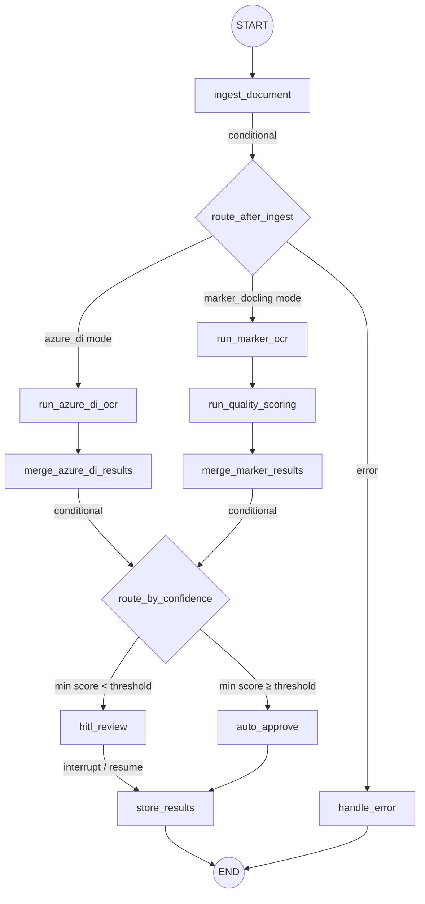
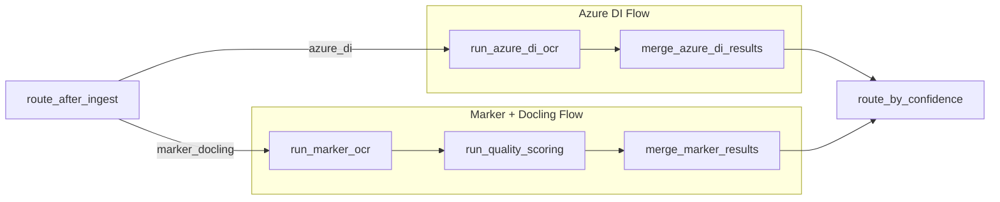

# Document Processing Workflow

> **Code references:** [`backend/app/workflow/document_graph.py`](../../../backend/app/workflow/document_graph.py), [`backend/app/workflow/nodes.py`](../../../backend/app/workflow/nodes.py), [`backend/app/workflow/state.py`](../../../backend/app/workflow/state.py)

The document processing workflow is the core pipeline of the Auto Transcription system. It is implemented as a **LangGraph StateGraph** that ingests a pharmaceutical PDF, conditionally routes it to one of two pipeline modes based on `settings.pipeline.mode`, scores confidence, and routes pages for human review or automatic approval.

---

## Graph Overview

The graph has two distinct flow paths that share a common head (ingest) and tail (confidence routing → HITL/approve → store):



### Flow Paths

| Pipeline Mode | Path |
|--------------|------|
| `azure_di` | `ingest_document` → `run_azure_di_ocr` → `merge_azure_di_results` → confidence routing → ... |
| `marker_docling` | `ingest_document` → `run_marker_ocr` → `run_quality_scoring` → `merge_marker_results` → confidence routing → ... |

The routing is determined at runtime by `route_after_ingest`, which reads `settings.pipeline.mode`. Only one path executes per invocation — there is no parallel fan-out to multiple engines.

---

## State Definition

The workflow operates on `DocumentState`, a `TypedDict` with annotated reducers so that state updates merge cleanly.

```python
class DocumentState(TypedDict):
    # Identity
    doc_id: str
    pdf_path: str
    filename: str
    total_pages: int

    # Per-engine OCR results (mode-specific)
    marker_results: Annotated[dict, _merge_dicts]    # marker_docling mode
    azure_di_results: Annotated[dict, _merge_dicts]  # azure_di mode
    quality_scores: dict                              # marker_docling mode (Docling)

    # Unified extraction output (both modes)
    extractions: Annotated[list, _merge_lists]
    confidence_scores: Annotated[dict, _merge_dicts]
    raw_markdown: Annotated[dict, _merge_dicts]

    # Page intelligence (planned)
    page_classifications: Annotated[dict, _merge_dicts]
    sections: list

    # HITL
    hitl_pages_for_review: list
    hitl_decisions: Annotated[list, _merge_lists]

    # Control
    status: str
    error: str | None
```

### Reducers

| Reducer | Behaviour |
|---|---|
| `_merge_lists(left, right)` | Appends `right` to `left` — used for `extractions`, `hitl_decisions` |
| `_merge_dicts(left, right)` | Shallow-merges `right` into `left` — used for per-page result dicts |

Pipeline modes populate different subsets of fields: `azure_di` mode writes to `azure_di_results` and `raw_markdown`; `marker_docling` mode writes to `marker_results`, `quality_scores`, and `raw_markdown`. Both modes converge on the common output fields `extractions` and `confidence_scores` after their respective merge nodes.

---

## Node Descriptions

### `ingest_document`

```python
async def ingest_document(state: DocumentState) -> dict
```

- **Validates** the PDF at `state["pdf_path"]` using PyMuPDF (`fitz`).
- **Counts pages** and sets `total_pages`.
- **Notifies the frontend** via `container.notification.send_update(doc_id, {"status": "ingested", ...})`.
- Returns `{"total_pages": n, "status": "ingested"}`.
- On a missing or corrupt PDF, returns `{"status": "error", "error": "..."}`.

### `run_azure_di_ocr` (azure_di mode)

```python
async def run_azure_di_ocr(state: DocumentState) -> dict
```

- Calls `container.ocr_engine.extract(pdf_path)` — resolves to `AzureDIOCRAdapter`.
- Computes per-page word confidence, handwriting statistics, barcodes, and selection marks.
- Stores full document markdown if available from Azure DI.
- Returns `{"azure_di_results": {...}, "raw_markdown": {...}, "status": "azure_di_complete"}`.

### `run_marker_ocr` (marker_docling mode)

```python
async def run_marker_ocr(state: DocumentState) -> dict
```

- Calls `container.ocr_engine.extract(pdf_path)` — resolves to `MarkerOCRAdapter`.
- Builds per-page markdown and word-count dictionaries.
- Returns `{"marker_results": {...}, "raw_markdown": {...}, "status": "marker_complete"}`.

### `run_quality_scoring` (marker_docling mode)

```python
async def run_quality_scoring(state: DocumentState) -> dict
```

- Calls `container.quality_scorer.score(pdf_path)` — uses `DoclingQualityAdapter`.
- Only runs in `marker_docling` mode (wired sequentially after `run_marker_ocr`).
- Returns `{"quality_scores": {...}, "status": "quality_scored"}`.

### `merge_azure_di_results`

```python
async def merge_azure_di_results(state: DocumentState) -> dict
```

Builds unified `extractions` and `confidence_scores` from Azure DI output. Confidence is computed per page using:

**Formula:** `0.50 × avg_word_confidence + 0.20 × min_word_confidence + 0.30 × validation_pass_rate`

- `avg_word_confidence` / `min_word_confidence`: from Azure DI's per-word confidence scores
- `validation_pass_rate`: from `validate_page_extraction()` plausibility checks

Returns `{"extractions": [...], "confidence_scores": {...}, "status": "merged"}`.

### `merge_marker_results`

```python
async def merge_marker_results(state: DocumentState) -> dict
```

Builds unified `extractions` and `confidence_scores` from Marker + Docling output. Confidence is computed per page using:

**Formula:** `0.60 × docling_quality_mean + 0.40 × validation_pass_rate`

- `docling_quality_mean`: average of Docling's `layout_score`, `table_score`, `ocr_score`, `parse_score`
- `validation_pass_rate`: from `validate_page_extraction()` plausibility checks

Returns `{"extractions": [...], "confidence_scores": {...}, "status": "merged"}`.

### `hitl_review`

```python
async def hitl_review(state: DocumentState) -> dict
```

- Identifies pages whose confidence falls below `settings.hitl.auto_approve_threshold`.
- Sends `hitl_required` status to the frontend via WebSocket.
- Calls **`interrupt()`** — the LangGraph native HITL primitive — to pause the workflow and yield a review payload to the frontend.
- When the human resumes via `Command(resume=feedback)`, returns `{"hitl_decisions": [...], "status": "reviewed"}`.
- Full details in [HITL Flow](./hitl-flow.md).

### `auto_approve`

```python
async def auto_approve(state: DocumentState) -> dict
```

- Sends `auto_approved` status to the frontend via WebSocket.
- Returns `{"status": "approved"}`.

### `store_results`

```python
async def store_results(state: DocumentState) -> dict
```

- Creates a `DigitalDocument` domain model from the final state.
- Persists via `document_store.save_document(...)`.
- Sends `completed` status to the frontend via WebSocket.
- Returns `{"status": "completed"}`.

### `handle_error`

```python
async def handle_error(state: DocumentState) -> dict
```

- Sends the error payload to the frontend via WebSocket.
- Returns `{"status": "error"}`.

---

## Conditional Routing

### `route_after_ingest`

Routes to the correct pipeline flow based on `settings.pipeline.mode`:

```python
def route_after_ingest(state: DocumentState) -> str:
    if state.get("status") == "error":
        return "handle_error"

    settings = get_settings()
    mode = settings.pipeline.mode

    if mode == "marker_docling":
        return "run_marker_ocr"
    return "run_azure_di_ocr"
```

This replaces the old parallel `Send()` fan-out. Only one pipeline flow executes — there is no concurrent execution of multiple OCR engines.

### `route_by_confidence`

After the active merge node produces `confidence_scores`, the graph evaluates:

```python
def route_by_confidence(state: DocumentState) -> str:
    scores = state.get("confidence_scores", {})
    if not scores:
        return "hitl_review"
    min_score = min(scores.values())
    if min_score < settings.hitl.review_threshold:
        return "hitl_review"
    return "auto_approve"
```

The threshold is configurable via `settings.hitl.review_threshold` (default `0.7`). If **any** page falls below it, the entire document is routed to human review.

---

## Confidence Scoring by Mode

Each pipeline mode has its own confidence formula, applied in its respective merge node:

| Mode | Merge Node | Formula | Components |
|------|-----------|---------|------------|
| `azure_di` | `merge_azure_di_results` | `0.50 × avg + 0.20 × min + 0.30 × val` | Azure DI per-word scores + validation rules |
| `marker_docling` | `merge_marker_results` | `0.60 × quality + 0.40 × val` | Docling quality scores + validation rules |

Both formulas produce a `[0.0, 1.0]` confidence per page. The `validate_page_extraction()` function applies the same plausibility checks in both modes (see [Validation Rules](../confidence-scoring/validation-rules.md)).

---

## Streaming to Frontend

The workflow does **not** use LangGraph's `astream()` for frontend communication. Instead, each node pushes status updates directly through the **notification port**:

```
Node → container.notification.send_update(doc_id, payload)
     → WebSocketNotifyAdapter
     → ConnectionManager.broadcast(channel, data)
     → WebSocket clients
```

This gives fine-grained control over what the frontend receives at each stage (`ingested`, `azure_di_running`, `marker_ocr_running`, `merging_results`, `hitl_required`, `completed`, etc.) without coupling the frontend to LangGraph's internal event stream.

---

## Checkpointing

The graph is compiled with an optional checkpointer:

```python
def build_document_graph(checkpointer=None):
    # ... graph construction ...
    if checkpointer is None:
        checkpointer = MemorySaver()
    return builder.compile(checkpointer=checkpointer)
```

| Mode | Checkpointer | Use Case |
|---|---|---|
| Development | `MemorySaver` (default) | Fast iteration, no persistence |
| Production | `PostgresSaver` | Fault tolerance, HITL resume across restarts |

Checkpointing is essential for the HITL flow: when `interrupt()` pauses the workflow, the full state is persisted. The same `thread_id` is used to resume, even if the server has restarted in the meantime.

---

## Graph Construction

`build_document_graph` wires everything together. Both pipeline flow paths are registered as nodes, but only one path is traversed at runtime based on `route_after_ingest`:

```python
builder = StateGraph(DocumentState)

# Common nodes
builder.add_node("ingest_document", ingest_document)
builder.add_node("hitl_review", hitl_review)
builder.add_node("auto_approve", auto_approve)
builder.add_node("store_results", store_results)
builder.add_node("handle_error", handle_error)

# Azure DI flow nodes
builder.add_node("run_azure_di_ocr", run_azure_di_ocr)
builder.add_node("merge_azure_di_results", merge_azure_di_results)

# Marker + Docling flow nodes
builder.add_node("run_marker_ocr", run_marker_ocr)
builder.add_node("run_quality_scoring", run_quality_scoring)
builder.add_node("merge_marker_results", merge_marker_results)

# Entry
builder.add_edge(START, "ingest_document")
builder.add_conditional_edges("ingest_document", route_after_ingest)

# Azure DI flow
builder.add_edge("run_azure_di_ocr", "merge_azure_di_results")
builder.add_conditional_edges("merge_azure_di_results", route_by_confidence)

# Marker + Docling flow
builder.add_edge("run_marker_ocr", "run_quality_scoring")
builder.add_edge("run_quality_scoring", "merge_marker_results")
builder.add_conditional_edges("merge_marker_results", route_by_confidence)

# Common tail
builder.add_edge("hitl_review", "store_results")
builder.add_edge("auto_approve", "store_results")
builder.add_edge("store_results", END)
builder.add_edge("handle_error", END)
```

### Flow Diagram



---

## Related Documentation

- [Compliance Review Subgraph](./compliance-review.md) — automated regulatory compliance checks
- [HITL Flow](./hitl-flow.md) — human-in-the-loop review mechanics
- [Composite Confidence Scorer](../confidence-scoring/composite-scorer.md) — how page confidence is calculated
- [Validation Rules](../confidence-scoring/validation-rules.md) — custom plausibility checks
