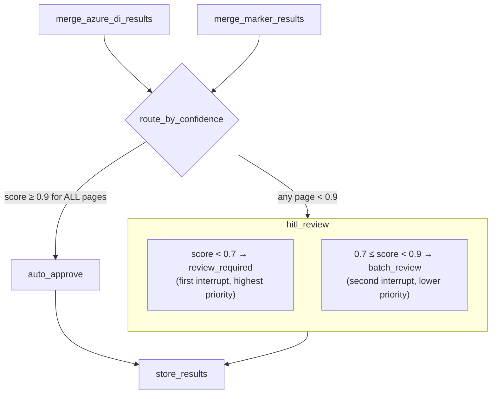
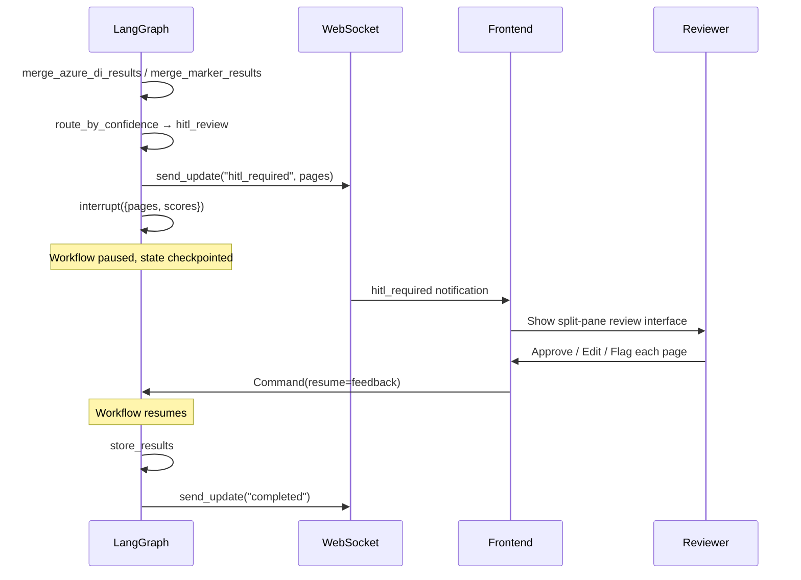

# Human-in-the-Loop (HITL) Flow

> **Code references:** [`backend/app/workflow/document_graph.py`](../../../backend/app/workflow/document_graph.py) (`hitl_review` node), [`backend/app/hitl/review_queue.py`](../../../backend/app/hitl/review_queue.py), [`backend/app/hitl/audit_trail.py`](../../../backend/app/hitl/audit_trail.py)

No OCR engine is 100 % accurate. Handwritten entries, degraded scans, complex table layouts, and unusual fonts all introduce errors that automated quality scoring cannot fully detect. The HITL flow ensures a qualified human reviewer validates every page that falls below the confidence threshold before results are persisted.

---

## Why HITL?

Pharmaceutical batch manufacturing records carry legal and regulatory weight. A single mis-read date, quantity, or signature can trigger audit findings. The HITL flow exists to:

1. **Catch OCR errors** — especially in handwritten content, poor-quality scans, and dense table layouts.
2. **Maintain data integrity** — every correction is attributed, timestamped, and auditable (ALCOA++ "Attributable" principle).
3. **Build confidence** — only high-confidence pages bypass human review; everything else is verified.

---

## Confidence-Based Routing

After the mode-specific merge node (`merge_azure_di_results` or `merge_marker_results`) computes a [composite confidence score](../confidence-scoring/composite-scorer.md) for each page, the `route_by_confidence` conditional edge determines the next step:



| Score Range | Classification | Action |
|---|---|---|
| **≥ 0.9** | `high` | `auto_approve` — no human review needed |
| **0.7 – 0.9** | `medium` | `batch_review` — second interrupt, lower priority queue |
| **< 0.7** | `low` | `review_required` — first interrupt, highest priority |

The threshold for routing to `hitl_review` vs. `auto_approve` is configurable via `settings.hitl.review_threshold` (default `0.9`). If **any** page in the document falls below the threshold, the entire document enters HITL review.

---

## LangGraph Native HITL

The HITL flow uses LangGraph's built-in `interrupt()` / `Command(resume=...)` mechanism rather than external queuing.

### Interrupt (Pause)

Inside the `hitl_review` node:

```python
async def hitl_review(state: DocumentState) -> dict:
    pages_for_review = [
        {"page_num": p, "confidence": state["confidence_scores"].get(str(p), 0)}
        for p in range(1, state["total_pages"] + 1)
        if state["confidence_scores"].get(str(p), 0) < settings.hitl.review_threshold
    ]

    await container.notification.send_update(state["doc_id"], {
        "status": "hitl_required",
        "pages_for_review": pages_for_review,
    })

    feedback = interrupt({
        "action": "review_required",
        "pages_for_review": pages_for_review,
        "quality_scores": state.get("quality_scores", {}),
    })

    return {
        "hitl_decisions": [feedback] if isinstance(feedback, dict) else feedback,
        "status": "reviewed",
    }
```

When `interrupt()` is called:

1. The workflow **pauses** and the current state is persisted by the checkpointer.
2. The interrupt payload (pages for review, quality scores) is returned to the caller.
3. The frontend receives a WebSocket notification with `status: "hitl_required"`.

### Resume (Continue)

When the human reviewer has finished:

```python
from langgraph.types import Command

await graph.ainvoke(
    Command(resume=feedback),
    config={"configurable": {"thread_id": thread_id}},
)
```

The `feedback` object contains the reviewer's decisions (approve / edit / flag per page). The workflow resumes from exactly where it paused, with `feedback` returned as the value of `interrupt()`. The node then writes the decisions to `hitl_decisions` and proceeds to `store_results`.

### Sequence Diagram



---

## Review Queue

> `backend/app/hitl/review_queue.py`

The `ReviewQueue` manages the ordered list of pages awaiting human review.

### Data Model

```python
class ReviewStatus(str, Enum):
    PENDING = "pending"
    IN_REVIEW = "in_review"
    APPROVED = "approved"
    EDITED = "edited"
    FLAGGED = "flagged"

@dataclass
class ReviewItem:
    doc_id: str
    page_num: int
    confidence: float
    status: ReviewStatus = ReviewStatus.PENDING
    reviewer: str | None = None
    reviewed_at: datetime | None = None
    original_extraction: dict | None = None
    corrected_extraction: dict | None = None
    correction_reason: str | None = None
```

### Queue Operations

| Method | Description |
|---|---|
| `add_pages(doc_id, pages)` | Builds `ReviewItem` objects from page data, **sorts by confidence ascending** (lowest first = highest priority) |
| `get_next(doc_id)` | Returns the first `PENDING` item |
| `get_all(doc_id)` | Returns all items for the document |
| `approve(doc_id, page_num, reviewer)` | Sets status to `APPROVED`, records reviewer and timestamp |
| `edit(doc_id, page_num, reviewer, corrected, reason)` | Sets status to `EDITED`, stores the corrected extraction and correction reason |
| `flag(doc_id, page_num, reviewer, reason)` | Sets status to `FLAGGED`, stores the flag reason |
| `get_progress(doc_id)` | Returns `{total, reviewed, remaining, corrections}` |

Pages are **sorted by confidence** so the reviewer always sees the most uncertain pages first.

---

## Audit Trail

> `backend/app/hitl/audit_trail.py`

Every correction is logged for 21 CFR Part 11 and Annex 11 compliance.

### Data Model

```python
@dataclass
class AuditEntry:
    doc_id: str
    page_num: int
    field_path: str       # dot-separated path, e.g. "table.row_3.quantity"
    original_value: str
    new_value: str
    reason: str
    reviewer: str
    timestamp: datetime   # defaults to utcnow
    entry_id: str         # auto-generated UUID
```

### Trail Operations

| Method | Description |
|---|---|
| `log_correction(doc_id, page_num, field_path, original_value, new_value, reason, reviewer)` | Creates and stores an `AuditEntry` |
| `get_entries(doc_id)` | All entries for a document |
| `get_page_entries(doc_id, page_num)` | Entries for a specific page |
| `export(doc_id)` | Returns a list of dicts with ISO timestamps, suitable for JSON export or regulatory submission |

The audit trail captures the **who** (reviewer), **when** (timestamp), **what** (field_path, original_value, new_value), and **why** (reason) of every correction — satisfying the ALCOA++ "Attributable" and "Contemporaneous" requirements.

---

## Frontend Review Interface

The frontend presents a **split-pane review interface**:

| Left Pane | Right Pane |
|---|---|
| Original scanned page (PDF render) | OCR extraction (editable markdown) |

### Keyboard Shortcuts

| Key | Action |
|---|---|
| **Enter** | Approve current page |
| **F** | Flag current page for further review |
| **E** | Enter edit mode on the current extraction |
| **Arrow Up / Down** | Navigate to previous / next page |

The review queue feeds pages in confidence-ascending order, so the reviewer naturally starts with the pages that need the most attention.

---

## Checkpointing and Fault Tolerance

The HITL flow depends on **checkpointing** to survive server restarts:

1. Before `interrupt()`, the full `DocumentState` is persisted by the checkpointer.
2. The `thread_id` (typically the `doc_id`) uniquely identifies the paused run.
3. On resume, the checkpointer restores the exact state, and the workflow continues from `interrupt()`.

| Environment | Checkpointer | Behaviour |
|---|---|---|
| Development | `MemorySaver` | State lost on restart — acceptable for dev |
| Production | `PostgresSaver` | State persisted in PostgreSQL — survives restarts, deployments, crashes |

---

## Related Documentation

- [Document Processing Workflow](./document-processing.md) — the parent graph that invokes HITL
- [Composite Confidence Scorer](../confidence-scoring/composite-scorer.md) — how page confidence is calculated
- [Validation Rules](../confidence-scoring/validation-rules.md) — custom checks that feed into confidence
- [Compliance Review](./compliance-review.md) — automated compliance analysis (downstream of HITL)
