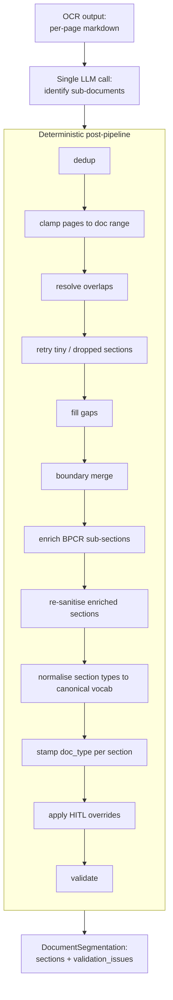

# Document Segmentation & BPCR Sub-Section Detection

> Back to [Wiki Index](../../README.md) · See also [Compliance Review](./compliance-review.md), [HITL Flow](./hitl-flow.md)

Uploaded packets often combine several documents (a cover sheet, a Batch Production and Control Record / BPCR, one or more SOPs, checklists, deviation forms, …) into a single PDF. **Segmentation** identifies the boundaries between these sub-documents so the compliance engine can route each section to the right rule set; **BPCR sub-section detection** then drills into batch-record sections to surface the 13 canonical sub-sections that GMP review depends on.

Both run inside `DocumentSegmenter.segment()` in [`backend/app/compliance/segmentation.py`](../../../backend/app/compliance/segmentation.py). All operator HITL edits land in a sidecar at `backend/data/documents/{doc_id}/segmentation.overrides.json` and survive re-segmentation.

## Flow



The pipeline is **idempotent**: `segment(segment(x)) == segment(x)` for every input — this is exercised in `backend/tests/compliance/test_segmentation_*.py`.

## The LLM pass

A single prompt returns a list of `DocumentSection` records with free-form snake-case `section_type` values (e.g. `cover_page`, `batch_record`, `sop_filling`, `equipment_log`). The LLM is intentionally not constrained to an enum — it would otherwise refuse to acknowledge novel templates. Vocabulary normalisation happens later in the post-pipeline (`normalize_section_types_to_canonical`).

## Post-pipeline invariants

| Stage | Invariant established |
|-------|----------------------|
| `dedup` | No two sections share the same `(start_page, end_page, section_type)` triple |
| `clamp` | Every section is contained within `[1, total_pages]` |
| `resolve_overlaps` | No two sections overlap on any page |
| `retry_tiny_and_dropped` | LLM-dropped pages get a small retry-budget call |
| `fill_gaps` | The union of section page ranges covers every page |
| `boundary_merge` | Adjacent same-type sections are merged |
| `enrich_with_bpcr_sub_sections` | BPCR parents are replaced by their detected 13 sub-sections |
| Re-sanitisation (clamp / resolve_overlaps / fill_gaps / dedupe) | Enrichment outputs satisfy all the geometric invariants above |
| `normalize_section_types_to_canonical` | `section_type` is one of the canonical values |
| `stamp_document_types` | Every section has a `document_type` populated |
| `apply_overrides` | Operator HITL edits are layered on top |
| `validate` | `validation_issues[]` is populated with any residual anomalies |

## BPCR sub-section detection (Spec 007)

The detector lives in [`backend/app/bmr/capabilities/bpcr_section_detect.py`](../../../backend/app/bmr/capabilities/bpcr_section_detect.py) and uses regex heuristics over per-page markdown to find the 13 canonical sub-sections:

```
cover_page, revision_summary, signatures, table_of_contents,
material_dispensing, equipment_list, manufacturing_operations,
in_process_controls, yield_calculation, packaging_instructions,
deviations_attached, attachments_index, signoff
```

Two helpers gate which top-level sections get drilled into:

```python
def _looks_like_bpcr(section_type: str) -> bool:
    """True when section_type contains 'batch_record', 'bpcr', ..."""

def _is_bpcr_parent(section: DocumentSection) -> bool:
    """True when the section should be drilled into BPCR sub-sections.

    Two-stage check that stays idempotent across re-runs:
      1. section_type matches a BPCR hint → drill.
      2. Fallback: section_type is NOT a known canonical BPCR
         sub-section AND section_id contains a BPCR hint → drill.
    """
```

The fallback exists because the LLM sometimes names a section `bpcr_main_record` but types it as `main_record` / `production_record` — types the vocabulary normaliser collapses to `unknown`. The fallback excludes already-flattened sub-section types so an enrich → re-enrich is a no-op.

### Page-number translation

The detector operates on **relative** page indexes within the BPCR parent. The enrichment pass translates those back into absolute page numbers:

```python
offset = section.start_page - 1
for span in section_map.spans:
    abs_start = max(section.start_page, span.start_page + offset)
    abs_end = min(section.end_page, span.end_page + offset)
    if abs_start > abs_end:
        continue
    flatten_plan.append((normalized_section_type, ..., abs_start, abs_end))
```

Each detected sub-section composes its `section_id` as `{parent_id}__{section_type}` so the new ids are guaranteed unique even when the same canonical sub-section type appears twice (which can happen across multiple BPCRs in one packet).

### Known limitations

* If the LLM mis-types the parent (e.g. labels pages 4–10 of a BPCR as `cover_page` instead of `batch_record`), the detector never sees those pages and the corresponding sub-sections (`equipment_list`, `manufacturing_operations`, …) stay unrecognised. Tracked as a segmentation-quality issue, not a detector issue.

## HITL segmentation overrides

Operator edits made via `PUT /api/compliance/{doc_id}/segmentation` are persisted to a sidecar so they survive re-segmentation runs (caused by re-OCR, operator disagreeing with the LLM and clicking *Re-run*, etc.).

**Storage** — JSON list of records, one per `(section_id, field)` change. Append-only in spirit; we keep history for audit (`recorded_at` + `actor`). On apply, the **last record per `(section_id, field)` wins**.

```
backend/data/documents/{doc_id}/
├── segmentation.json              # current authoritative segmentation
└── segmentation.overrides.json    # operator edits (sidecar — survives re-segmentation)
```

**Apply policy** — operator intent is sacred:

* `apply_overrides` runs **at the end** of the segmentation pipeline (after the geometric / vocabulary post-processes).
* When an override's target `section_id` is missing from the fresh LLM output, emit `segmentation.override_orphaned` and drop the override (HITL has to re-decide).
* When an override introduces a geometric anomaly (overlap, out-of-range page), the validators flag it as a warning but **the override stands** — the operator's word is final.

To reset overrides to the LLM defaults, delete the sidecar file:

```bash
rm backend/data/documents/{doc_id}/segmentation.overrides.json
```

## API surface

| Method | Route | Purpose |
|--------|-------|---------|
| `POST` | `/api/compliance/{doc_id}/segment` | Re-run segmentation from current OCR output |
| `GET` | `/api/compliance/{doc_id}/segmentation` | Current authoritative segmentation |
| `PUT` | `/api/compliance/{doc_id}/segmentation` | Apply an operator override (writes to sidecar) |

## Validation issues surfaced to the UI

The `validation_issues[]` field on `DocumentSegmentation` carries anomalies the post-pipeline detected but did not auto-fix:

| Issue code | Meaning |
|-----------|---------|
| `coverage_gap` | One or more pages are not covered by any section |
| `coverage_overlap` | Two sections claim the same page |
| `duplicate_section_id` | Two sections share the same `section_id` |
| `out_of_range_page` | An override or LLM emission has a page outside `[1, total_pages]` |
| `override_orphaned` | Operator override targeted a `section_id` that no longer exists |
| `bpcr_subsection_low_coverage` | BPCR enrichment found <50% of canonical sub-sections (signal for operator review) |

The frontend surfaces these as orange warning chips on the segmentation panel.

## Specs

- **Spec 011** — Segmentation Robust Coverage (`specs/011-segmentation-robust-coverage/`) — pipeline ordering, idempotency, HITL overrides
- **Spec 007** — BPCR Section Detection — the 13 canonical sub-sections, detector heuristics

## Related Pages

- [Document Processing](./document-processing.md) — Where segmentation slots into the LangGraph state graph
- [Compliance Review](./compliance-review.md) — How segmented sections are routed to rule agents
- [HITL Flow](./hitl-flow.md) — Page-level review (distinct from segmentation HITL)
- [Rule Authoring Playbook](../../rule_authoring_playbook.md) — Adding new rule profiles per section type
